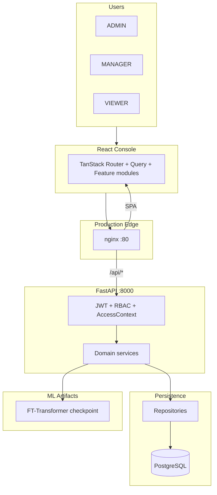
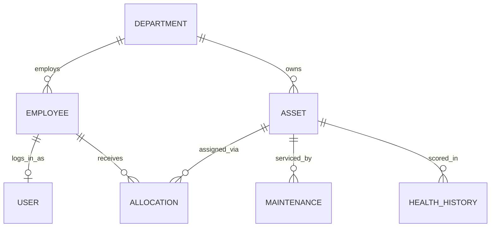
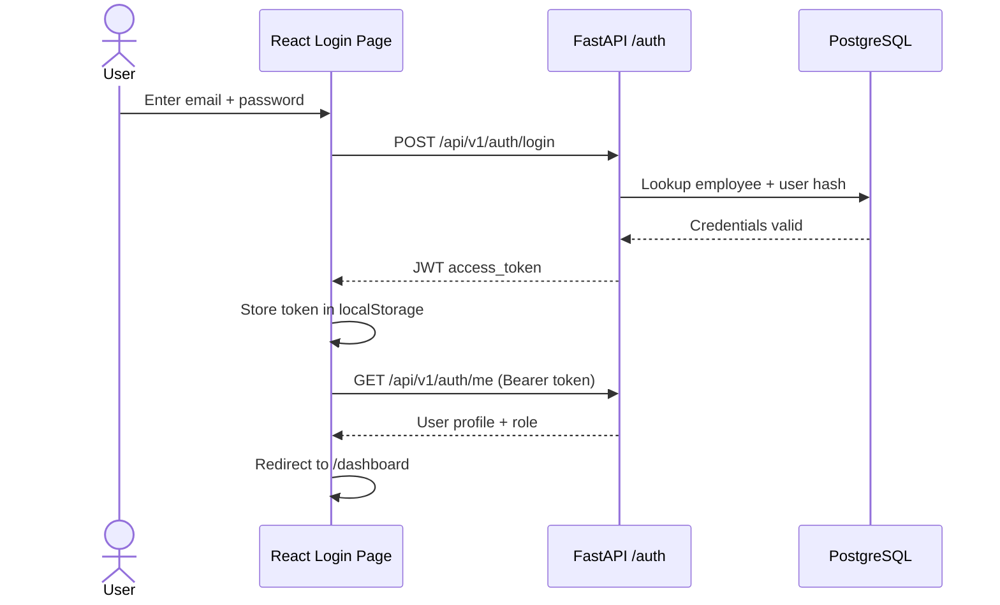
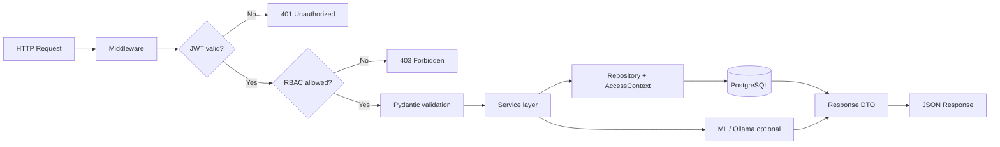
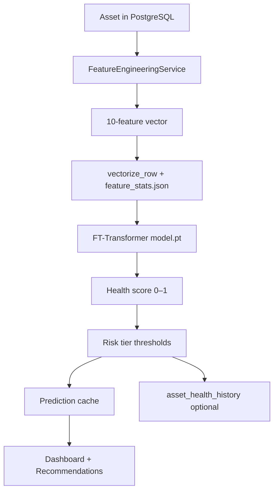
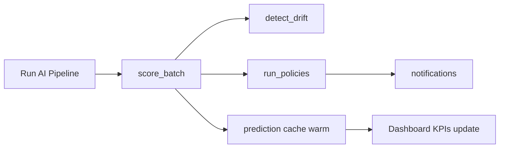
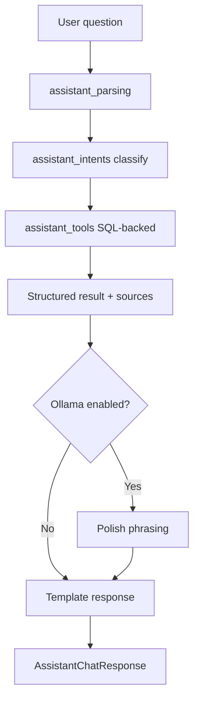

<div align="center">

# AssetFlow AI

**Enterprise Asset Lifecycle Intelligence Platform**

*Full-stack application with ML-powered health prediction, role-based operations console, and production AWS deployment.*

<br/>

| FastAPI | React 19 | PostgreSQL | FT-Transformer | JWT + RBAC | nginx + EC2 |
|:---:|:---:|:---:|:---:|:---:|:---:|

<br/>

[Overview](#overview) · [What I Built](#what-i-built) · [Architecture](#architecture) · [Key Flows](#key-flows) · [File Structure](#file-structure) · [Tech Stack](#tech-stack) · [Local Setup](#local-setup) · [AWS Deployment](#aws-production-deployment) · [Demo](#demo-walkthrough)

</div>

---

## Overview

AssetFlow AI is an end-to-end enterprise asset management platform designed for operations teams. It unifies asset registration, maintenance scheduling, department-scoped dashboards, and AI-driven fleet health scoring in a single production-style console.

The system demonstrates **full product ownership**: relational schema design, layered API architecture, custom PyTorch inference, grounded AI assistant tooling, and a **live deployment on AWS EC2** (no Docker) behind nginx with systemd-managed services.

**Problem addressed:** Operations teams lack a single view of asset health, maintenance risk, and departmental accountability. Spreadsheets and siloed tools do not scale to predictive maintenance or executive reporting.

**Solution delivered:** A secure, role-scoped web platform where administrators and managers monitor fleet KPIs, run batch ML inference on live data, receive actionable recommendations, and query an assistant grounded in SQL — not hallucinated inventory.

---

### Platform capabilities

| Area | Implementation |
|------|----------------|
| **API** | 15+ protected domains, OpenAPI-documented REST under `/api/v1` |
| **Backend** | 35 domain services across lifecycle, intelligence, AI, and reporting |
| **Frontend** | React 19 console with 10 routed screens, TanStack Router & Query |
| **Security** | JWT authentication, bcrypt passwords, 3 roles, 15 permissions, department scoping |
| **Machine learning** | Custom FT-Transformer (PyTorch) for health score regression |
| **AI layer** | Tool-calling assistant + optional Ollama narrative enhancement |
| **Data** | PostgreSQL + Alembic migrations; reproducible demo seed (200+ assets) |
| **Testing** | Pytest suite covering auth, RBAC, access scope, health, and reports |
| **Deployment** | AWS EC2 (Ubuntu), nginx reverse proxy, systemd, PostgreSQL on-host |

### Production deployment (AWS)

Deployed **all-in-one EC2** without containers:

```text
Browser → nginx :80
           ├─ /              → React SPA (/var/www/assetflow)
           ├─ /api/          → uvicorn 127.0.0.1:8000
           └─ /health|/ready|/docs → FastAPI
FastAPI → PostgreSQL (localhost) + ml/artifacts/
```

**Infrastructure work completed:**

- Provisioned Ubuntu EC2 with security groups (SSH, HTTP)
- Installed and configured PostgreSQL, Python venv, Node 20, nginx
- Applied Alembic migrations and demo database seeding
- Deployed ML artifacts (`model.pt`, `feature_stats.json`) for inference
- Configured systemd unit (`assetflow.service`) for API process management
- Built production frontend with same-origin API (`VITE_API_BASE_URL=/api/v1`)
- Resolved production issues: nginx permissions, duplicate config in `conf.d/`, UTF-16 env file encoding on Windows, and frontend API URL fallbacks

**Live endpoints:** `/health` (liveness), `/ready` (DB + ML readiness), `/docs` (Swagger UI).

Configuration templates live in [`deploy/`](deploy/) (`nginx.conf`, `assetflow.service`, `.env.production.example`).

---

## Architecture



### Backend design

Strict layered architecture — HTTP handlers never query the database directly.

| Layer | Location | Responsibility |
|-------|----------|----------------|
| Presentation | `app/api/v1/endpoints/` | HTTP mapping, dependency injection |
| Contracts | `app/schemas/` | Pydantic request/response DTOs |
| Application | `app/services/` | Business rules, ML/LLM orchestration |
| Infrastructure | `app/repositories/` | Scoped queries, pagination |
| Persistence | `app/models/` | SQLAlchemy 2.0 ORM, Alembic migrations |
| Cross-cutting | `app/core/` | Config, security, enums, thresholds |

**Request path:** Middleware → JWT decode → RBAC check → `AccessContext` (department scope) → service → repository → PostgreSQL.

**Intelligence path:** `FeatureEngineeringService` extracts features from live DB state → `PredictionService` runs FT-Transformer inference → results cached and optionally persisted to `asset_health_history`.

### Dual-dataset design

| Dataset | Source | Purpose |
|---------|--------|---------|
| Operational | `python -m app.seeding --profile demo --reset` | Application demo (~200 assets in PostgreSQL) |
| Training | `python -m ml.data` → ETL → `python -m ml.train` | File-based parquet under `ml/artifacts/` |



Training data is **never bulk-loaded into OLTP**. Inference reads `model.pt` + `feature_stats.json` from disk only.

---

## Key Flows

### 1. Authentication and session flow



After login, every protected request sends `Authorization: Bearer <token>`. The API decodes the JWT, loads the user, checks RBAC permissions, and builds an `AccessContext` for department scoping.

### 2. API request lifecycle (backend)



Handlers in `app/api/v1/endpoints/` stay thin — all business logic lives in `app/services/`.

### 3. ML inference flow



Training data flows separately: `ml/data` → `ml/etl` → `ml/train` → artifacts on disk. Inference never reads training parquet at runtime.

### 4. Intelligence pipeline (batch operations)



Triggered from the Operations UI or an optional background scheduler.

### 5. AI assistant flow



The assistant executes **database tools first** — asset counts, high-risk lists, maintenance queues — then optionally refines wording. Numbers and tags are never invented by the LLM.

### 6. Production request routing (AWS)

```mermaid
flowchart TB
  B[Browser] --> N[nginx :80]
  N -->|GET /login, /dashboard| S[/var/www/assetflow SPA]
  N -->|GET/POST /api/v1/*| U[uvicorn :8000 systemd]
  N -->|GET /health /ready /docs| U
  U --> P[(PostgreSQL)]
  U --> M[ml/artifacts/]
  S -->|fetch /api/v1| N
```

Same-origin design: the browser only talks to nginx on port 80. uvicorn is bound to `127.0.0.1:8000` and not exposed publicly.

---

## Tech Stack

| Layer | Technologies |
|-------|--------------|
| API | FastAPI, Pydantic v2, Uvicorn |
| Database | PostgreSQL, SQLAlchemy 2, Alembic |
| Security | JWT, bcrypt, RBAC, department `AccessContext` |
| Frontend | React 19, TypeScript, Vite, TanStack Router & Query |
| UI | Tailwind CSS v4, Radix UI, Recharts |
| ML | PyTorch, custom FT-Transformer |
| LLM (optional) | Ollama HTTP client with template fallbacks |
| Production | AWS EC2, nginx, systemd |

---

## Machine Learning

### Pipeline

| Stage | Command | Output |
|-------|---------|--------|
| Synthetic data | `python -m ml.data --rows 80000 --assets 9000` | Labeled parquet snapshots |
| ETL | `python -m ml.etl --source file` | Normalized splits + `feature_stats.json` |
| Training | `python -m ml.train` | `model.pt` checkpoint |
| Inference | API `score-batch` or `python -m ml.predict --asset-tag IT-LAP-0001` | Health score 0–1 + risk tier |

### FT-Transformer

Custom tabular transformer in `ml/models/ft_transformer.py`: each feature becomes a token; self-attention learns cross-feature interactions (e.g. failure count × maintenance neglect). Regression head outputs a sigmoid health score. Training uses MSE loss; risk tiers are derived post-prediction via `core/health_thresholds.py`.

**Feature contract (10 inputs):** asset type, age, utilization, operational hours, maintenance count, days since maintenance, failures, downtime, allocations, transfers.

**Explainability:** Rule-based narratives in `PredictionExplanationService` — traceable ops reasons alongside model scores.

---

## AI Integration

Three distinct systems, each with graceful degradation:

| System | Grounding | Output |
|--------|-----------|--------|
| Health ML | SQL features → FT-Transformer | Numeric score + risk tier |
| Assistant | SQL via tool functions | Answer + cited `sources` |
| Reports | Aggregated analytics | Template or Ollama-enhanced narrative |

**Intelligence pipeline** (Operations → Run AI pipeline): batch scoring → drift detection → policy automation → notifications.

The assistant **never fabricates counts or asset tags** — it executes repository-backed tools, then optionally polishes phrasing via Ollama.

---

## Role Matrix

| Capability | ADMIN | MANAGER | VIEWER |
|:-----------|:-----:|:-------:|:------:|
| Organization-wide data | ✓ | — | — |
| Department-scoped data | ✓ | ✓ | ✓ |
| Write assets / maintenance | ✓ | ✓ | — |
| Run AI pipeline | ✓ | ✓ | — |
| Enhanced reports | ✓ | ✓ | — |
| AI assistant | ✓ | ✓ | ✓ |
| Manage org structure | ✓ | — | — |

Seeded roles: first IT Manager → ADMIN; other managers → MANAGER; remaining employees → VIEWER. Login accounts are created per employee with generated temporary passwords at seed time.

---

## File Structure

High-level monorepo layout. Feature code is grouped by domain; deploy artifacts and ML training are isolated from the OLTP path.

```
AssetFlow-AI/
│
├── app/                              # FastAPI backend
│   ├── main.py                       # App entry, lifespan, CORS, health routes
│   ├── api/v1/
│   │   ├── router.py                 # Route registration
│   │   └── endpoints/                # HTTP handlers (thin layer)
│   │       ├── auth.py               # Login, me, password change
│   │       ├── assets.py             # Asset CRUD + search
│   │       ├── dashboard.py          # KPIs, workspace summary
│   │       ├── intelligence.py       # Predict, score-batch, recommendations
│   │       ├── assistant.py          # Grounded chat
│   │       ├── operations.py         # Pipeline, reports, notifications
│   │       ├── maintenance.py        # Maintenance records
│   │       ├── allocations.py        # Employee assignments
│   │       ├── transfers.py          # Inter-department moves
│   │       ├── employees.py          # Org directory
│   │       ├── departments.py        # Department management
│   │       ├── timeline.py           # Asset event history
│   │       └── lookups.py            # Reference data
│   ├── core/                         # Config, security, enums, RBAC, DB session
│   ├── models/                       # SQLAlchemy ORM entities
│   ├── schemas/                      # Pydantic request/response DTOs
│   ├── repositories/                 # Scoped queries, pagination
│   ├── services/                     # Business logic (35 services)
│   │   ├── auth_service.py
│   │   ├── prediction_service.py     # FT-Transformer inference
│   │   ├── intelligence_pipeline_service.py
│   │   ├── assistant_service.py      # Tool-calling assistant
│   │   ├── dashboard_service.py
│   │   └── …
│   ├── seeding/                      # Demo data generator (--profile demo)
│   ├── middleware/                   # Request logging
│   └── exceptions/                   # Global error handlers
│
├── frontend/                         # React 19 SPA
│   ├── src/
│   │   ├── routes/                   # TanStack Router file routes
│   │   │   ├── login.tsx
│   │   │   ├── change-password.tsx
│   │   │   └── _app/                 # Authenticated shell
│   │   │       ├── dashboard.tsx     # Operations center
│   │   │       ├── assets.tsx        # Asset registry
│   │   │       ├── assets.$id.tsx    # Asset detail + intelligence
│   │   │       ├── maintenance.tsx
│   │   │       ├── reports.tsx
│   │   │       ├── employees.tsx
│   │   │       ├── departments.tsx
│   │   │       └── settings.tsx
│   │   ├── features/                 # Feature-sliced modules
│   │   │   ├── auth/                 # Login, logo, hero
│   │   │   ├── dashboard/            # KPIs, charts, recommendations
│   │   │   ├── assets/               # Registry, lifecycle, health charts
│   │   │   ├── intelligence/         # Pipeline hooks
│   │   │   ├── operations/           # Reports, notifications API
│   │   │   ├── maintenance/
│   │   │   ├── employees/
│   │   │   └── departments/
│   │   ├── lib/
│   │   │   ├── api.ts                # Fetch client + JWT attachment
│   │   │   ├── auth-context.tsx      # Session state
│   │   │   ├── adapters/             # Backend DTO → UI types
│   │   │   └── types/
│   │   └── components/               # Shared UI (app-shell, form-dialog, …)
│   └── .env.production.example       # VITE_API_BASE_URL=/api/v1
│
├── ml/                               # ML pipeline (file-based, not in DB)
│   ├── data/                         # Synthetic generator, schema, type profiles
│   ├── etl/                          # Normalization, feature stats
│   ├── models/ft_transformer.py      # Custom PyTorch model
│   ├── train.py                      # Training loop
│   ├── predict.py                    # CLI inference
│   └── artifacts/                    # model.pt, feature_stats.json (gitignored)
│
├── alembic/versions/                 # DB migrations 001–006
├── deploy/                           # Production templates
│   ├── nginx.conf                    # SPA + /api/ reverse proxy
│   ├── assetflow.service             # systemd unit for uvicorn
│   └── .env.production.example
├── tests/                            # Pytest (auth, RBAC, health, reports)
├── scripts/dev/                      # Manual diagnostic scripts
├── requirements.txt                  # Backend dependencies
├── requirements-ml.txt               # PyTorch + training deps
└── .env.example                      # Local development config
```

### Frontend route map

| Route | Screen | Primary API |
|-------|--------|-------------|
| `/login` | Sign-in | `POST /auth/login` |
| `/dashboard` | Operations center | `GET /dashboard/summary` |
| `/assets` | Asset registry | `GET /assets` |
| `/assets/:id` | Asset detail + ML | `GET /assets/{id}`, intelligence endpoints |
| `/maintenance` | Maintenance queue | `GET /maintenance` |
| `/reports` | Executive reports | `GET /operations/reports/analytics` |
| `/employees` | Directory | `GET /employees` |
| `/departments` | Org structure | `GET /departments` |
| `/settings` | Profile / admin | `GET /auth/me` |

---

## Local Setup

### Prerequisites

Python 3.11+ · Node 20+ · PostgreSQL · (optional) Ollama for LLM features

### Backend

```bash
cp .env.example .env
python -m venv .venv && source .venv/bin/activate   # Windows: .venv\Scripts\activate
pip install -r requirements.txt
alembic upgrade head
python -m app.seeding --profile demo --reset
uvicorn app.main:app --reload
```

Save the seeded credentials printed in the terminal.

### Frontend

```bash
cd frontend
cp .env.example .env
npm install
npm run dev
```

Open `http://localhost:5173`. API default: `http://127.0.0.1:8000/api/v1`.

### ML training (optional)

```bash
pip install -r requirements-ml.txt
python -m ml.data --rows 80000 --assets 9000 --seed 42
python -m ml.etl --source file
python -m ml.train
```

---

## AWS Production Deployment

### Architecture summary

Single Ubuntu EC2 instance: PostgreSQL + uvicorn (systemd) + React build served by nginx. Port 8000 is **not** exposed publicly.

### Quick deploy sequence

```bash
# 1. System packages
sudo apt update && sudo apt install -y python3-venv git nginx postgresql postgresql-contrib build-essential
curl -fsSL https://deb.nodesource.com/setup_20.x | sudo -E bash - && sudo apt install -y nodejs

# 2. Database
sudo -u postgres psql -c "CREATE USER assetflow WITH PASSWORD 'YOUR_PASSWORD';"
sudo -u postgres psql -c "CREATE DATABASE assetflow_ai OWNER assetflow;"

# 3. Application
git clone <repo-url> && cd AssetFlow-AI
python3 -m venv .venv && source .venv/bin/activate
pip install -r requirements.txt
cp deploy/.env.production.example .env   # edit DATABASE_URL, JWT_SECRET_KEY, CORS_ORIGINS

# 4. ML artifacts + database
scp ml/artifacts/model.pt ml/artifacts/feature_stats.json ubuntu@EC2:/home/ubuntu/AssetFlow-AI/ml/artifacts/
alembic upgrade head
python -m app.seeding --profile demo --reset

# 5. Frontend — build on laptop if EC2 RAM is limited
cd frontend
cp .env.production.example .env.production   # UTF-8 only; see example file
npm run build

# 6. Serve SPA (www-data cannot read /home/ubuntu)
sudo mkdir -p /var/www/assetflow
sudo cp -r frontend/dist/. /var/www/assetflow/
sudo chown -R www-data:www-data /var/www/assetflow

# 7. systemd + nginx
sudo cp deploy/assetflow.service /etc/systemd/system/
sudo cp deploy/nginx.conf /etc/nginx/sites-available/assetflow
sudo ln -sf /etc/nginx/sites-available/assetflow /etc/nginx/sites-enabled/
sudo rm -f /etc/nginx/sites-enabled/default /etc/nginx/conf.d/assetflow.conf
sudo systemctl daemon-reload && sudo systemctl enable --now assetflow
sudo nginx -t && sudo systemctl reload nginx
```

### Post-deploy verification

| Check | URL | Expected |
|-------|-----|----------|
| Liveness | `/health` | `{"status":"ok"}` |
| Readiness | `/ready` | DB + ML artifacts OK |
| Frontend | `/login` | Sign-in page (HTTP 200) |
| API docs | `/docs` | Swagger UI |

### Common production pitfalls (resolved during deploy)

| Issue | Cause | Fix |
|-------|-------|-----|
| nginx 500 | `www-data` cannot read `/home/ubuntu` | Serve from `/var/www/assetflow` |
| nginx 500 (duplicate) | Stale config in `/etc/nginx/conf.d/` | Remove duplicate site file |
| "Unable to reach API" | Frontend built with `127.0.0.1` fallback | Rebuild with `VITE_API_BASE_URL=/api/v1` (UTF-8 `.env.production`) |
| `npm run build` killed | EC2 out of memory | Build on laptop, `scp dist/` to server |
| Login fails | Random seed passwords | Use printed credentials or reset via Python/shell |

### Cost management

Stop the EC2 instance when not demoing. Consider an Elastic IP if you need a stable URL across stop/start cycles.

---

## Demo Walkthrough

| Step | Action |
|------|--------|
| 1 | Sign in as seeded ADMIN |
| 2 | Operations → Dashboard — review KPIs and fleet health |
| 3 | Run **AI pipeline** — watch scores and recommendations update |
| 4 | Open asset `IT-LAP-0001` — lifecycle tabs + intelligence assessment |
| 5 | Assistant: *"Which assets are high risk?"* — verify cited sources |
| 6 | Reports → toggle enhanced analysis (template fallback if Ollama off) |

| Demo asset | Tag | Highlight |
|------------|-----|-----------|
| Laptop | `IT-LAP-0001` | Lifecycle + ML intelligence |
| Server | `SRV-PROD-01` | High-risk server profile |
| Printer | `ADM-PRT-001` | Maintenance recommendations |

---

## Testing

```bash
pytest tests/ -v
cd frontend && npx tsc --noEmit && npm run build
```

| Module | Coverage |
|--------|----------|
| `test_auth_integration.py` | Login, JWT, password change |
| `test_permissions.py` | Role permission matrix |
| `test_access_scope.py` | Department data scoping |
| `test_health.py` | `/health`, `/ready` probes |
| `test_reports_analytics_benchmarks.py` | Executive report analytics |

---

## Environment Variables

| Variable | Purpose |
|----------|---------|
| `DATABASE_URL` | PostgreSQL connection string |
| `JWT_SECRET_KEY` | Access token signing |
| `ML_ENABLED` | Gate inference endpoints |
| `ML_MODEL_PATH` / `ML_FEATURE_STATS_PATH` | Deployed model artifacts |
| `CORS_ORIGINS` | Allowed origins (production EC2 IP) |
| `ASSISTANT_USE_OLLAMA` | Enable LLM polish for assistant/reports |
| `VITE_API_BASE_URL` | Frontend API base (`/api/v1` in production) |

See [`.env.example`](.env.example) and [`deploy/.env.production.example`](deploy/.env.production.example).

---

## Design Principles

1. **Operations-first** — attention queues and next actions, not vanity metrics
2. **Scoped truth** — department filters enforced in SQL, not client-side
3. **AI with accountability** — model scores plus cited tool outputs; LLM is optional
4. **Layered and testable** — thin handlers, orchestrated services, isolated repositories
5. **Demo-resilient** — full functionality without Ollama; graceful ML and network fallbacks

---

<div align="center">

**AssetFlow AI** — designed, built, and deployed end-to-end.

*Schema to API to ML inference to production AWS hosting.*

</div>
