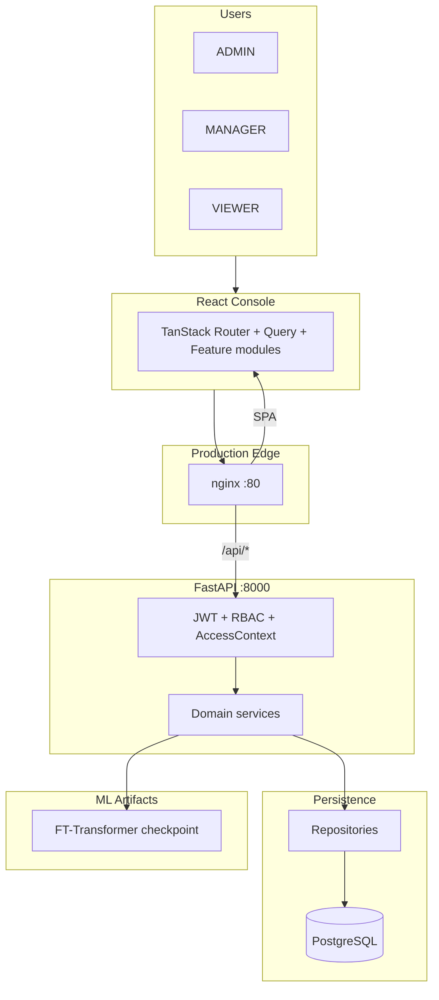
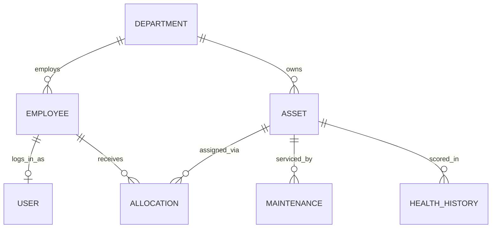
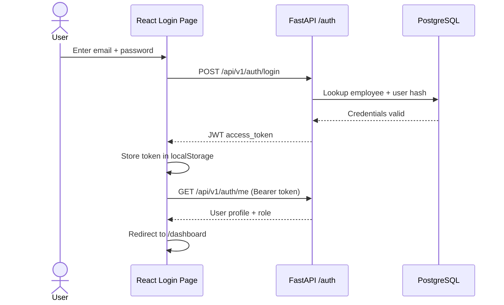
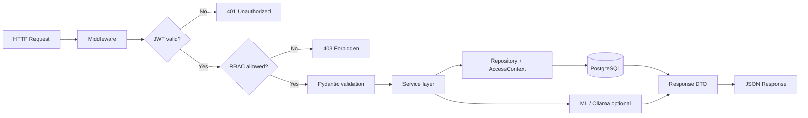
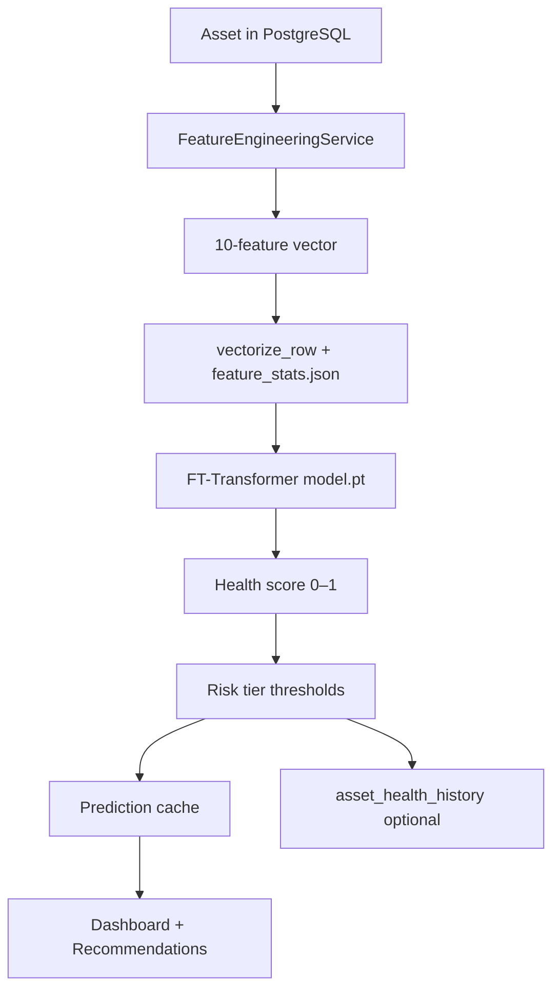
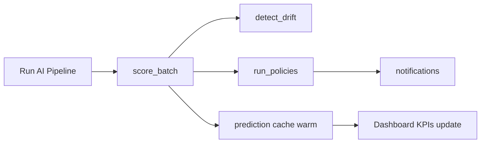
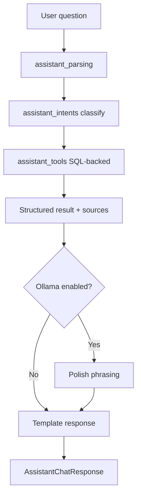
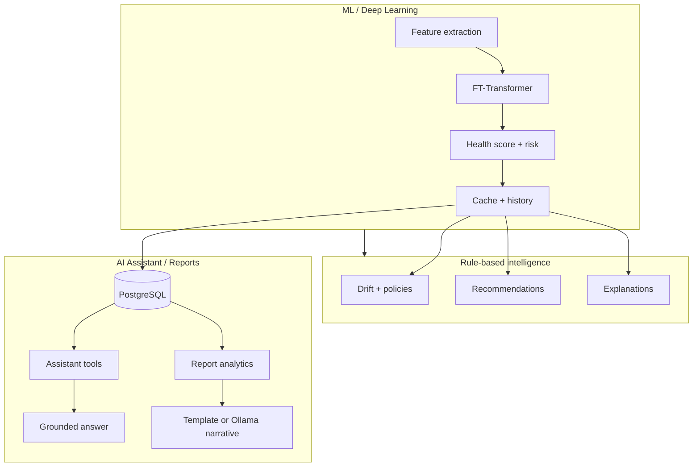

<div align="center">

# AssetFlow AI

**Enterprise Asset Lifecycle Intelligence Platform**

*Full-stack application with ML-powered health prediction, role-based operations console, and production AWS deployment.*

<br/>

| FastAPI | React 19 | PostgreSQL | FT-Transformer | JWT + RBAC | nginx + EC2 |
|:---:|:---:|:---:|:---:|:---:|:---:|

<br/>

[Overview](#overview) · [What I Built](#what-i-built) · [Architecture](#architecture) · [System Flows](#system-flows) · [Intelligence Deep Dive](#intelligence-systems--deep-dive) · [File Structure](#file-structure) · [Local Setup](#local-setup) · [AWS Deployment](#aws-production-deployment) · [Demo](#demo-walkthrough)

</div>

---

## Overview

AssetFlow AI is an end-to-end enterprise asset management platform designed for operations teams. It unifies asset registration, maintenance scheduling, department-scoped dashboards, and AI-driven fleet health scoring in a single production-style console.

The system demonstrates **full product ownership**: relational schema design, layered API architecture, custom PyTorch inference, grounded AI assistant tooling, and a **live deployment on AWS EC2** (no Docker) behind nginx with systemd-managed services.

**Problem addressed:** Operations teams lack a single view of asset health, maintenance risk, and departmental accountability. Spreadsheets and siloed tools do not scale to predictive maintenance or executive reporting.

**Solution delivered:** A secure, role-scoped web platform where administrators and managers monitor fleet KPIs, run batch ML inference on live data, receive actionable recommendations, and query an assistant grounded in SQL — not hallucinated inventory.

---

### Platform capabilities

| Area | Implementation |
|------|----------------|
| **API** | 15+ protected domains, OpenAPI-documented REST under `/api/v1` |
| **Backend** | 35 domain services across lifecycle, intelligence, AI, and reporting |
| **Frontend** | React 19 console with 10 routed screens, TanStack Router & Query |
| **Security** | JWT authentication, bcrypt passwords, 3 roles, 15 permissions, department scoping |
| **Machine learning** | Custom FT-Transformer (PyTorch) for health score regression |
| **AI layer** | Tool-calling assistant + optional Ollama narrative enhancement |
| **Data** | PostgreSQL + Alembic migrations; reproducible demo seed (200+ assets) |
| **Testing** | Pytest suite covering auth, RBAC, access scope, health, and reports |
| **Deployment** | AWS EC2 (Ubuntu), nginx reverse proxy, systemd, PostgreSQL on-host |

### Production deployment (AWS)

Deployed **all-in-one EC2** without containers:

```text
Browser → nginx :80
           ├─ /              → React SPA (/var/www/assetflow)
           ├─ /api/          → uvicorn 127.0.0.1:8000
           └─ /health|/ready|/docs → FastAPI
FastAPI → PostgreSQL (localhost) + ml/artifacts/
```

**Infrastructure work completed:**

- Provisioned Ubuntu EC2 with security groups (SSH, HTTP)
- Installed and configured PostgreSQL, Python venv, Node 20, nginx
- Applied Alembic migrations and demo database seeding
- Deployed ML artifacts (`model.pt`, `feature_stats.json`) for inference
- Configured systemd unit (`assetflow.service`) for API process management
- Built production frontend with same-origin API (`VITE_API_BASE_URL=/api/v1`)
- Resolved production issues: nginx permissions, duplicate config in `conf.d/`, UTF-16 env file encoding on Windows, and frontend API URL fallbacks

**Live endpoints:** `/health` (liveness), `/ready` (DB + ML readiness), `/docs` (Swagger UI).

Configuration templates live in [`deploy/`](deploy/) (`nginx.conf`, `assetflow.service`, `.env.production.example`).

---

## Architecture

### System overview diagram



**What this shows:** The platform is a three-tier system with an intelligence layer on disk. Users interact only with the React console. In production, nginx is the single public entry point — it serves the SPA and proxies API traffic to uvicorn. Every protected API call passes through JWT authentication and RBAC before reaching domain services. Services read/write PostgreSQL through repositories and load the FT-Transformer checkpoint from `ml/artifacts/` at inference time. The frontend never runs ML locally; scoring is always server-side.

### Backend design

Strict layered architecture — HTTP handlers never query the database directly.

| Layer | Location | Responsibility |
|-------|----------|----------------|
| Presentation | `app/api/v1/endpoints/` | HTTP mapping, dependency injection |
| Contracts | `app/schemas/` | Pydantic request/response DTOs |
| Application | `app/services/` | Business rules, ML/LLM orchestration |
| Infrastructure | `app/repositories/` | Scoped queries, pagination |
| Persistence | `app/models/` | SQLAlchemy 2.0 ORM, Alembic migrations |
| Cross-cutting | `app/core/` | Config, security, enums, thresholds |

**Request path:** Middleware → JWT decode → RBAC check → `AccessContext` (department scope) → service → repository → PostgreSQL.

**Intelligence path:** `FeatureEngineeringService` extracts features from live DB state → `PredictionService` runs FT-Transformer inference → results cached and optionally persisted to `asset_health_history`.

### Data model diagram

| Dataset | Source | Purpose |
|---------|--------|---------|
| Operational | `python -m app.seeding --profile demo --reset` | Application demo (~200 assets in PostgreSQL) |
| Training | `python -m ml.data` → ETL → `python -m ml.train` | File-based parquet under `ml/artifacts/` |



**What this shows:** The operational database models a real org structure. Departments own assets and employ people. Each employee can have one login (`USER`). Assets move through lifecycle events — allocations to employees, maintenance records, and ML health snapshots (`HEALTH_HISTORY`). This schema is what the assistant tools and feature engineering read at runtime. Training parquet files are separate and never imported into these tables.

---

## System Flows

Each diagram below maps a concrete user or system journey. Read the diagram first, then the explanation.

### 1. Authentication and session



**What this is:** Standard stateless JWT authentication. `AuthService.login()` resolves the employee by email, verifies the bcrypt hash on the linked `User` row, and issues a signed access token containing `user_id` and `role`. The frontend stores the token and attaches it as `Authorization: Bearer` on every subsequent request. `GET /auth/me` hydrates the session with department, job title, and `must_change_password` flag for route guards.

**Why it matters:** All intelligence and assistant endpoints are protected the same way. Role (`ADMIN` / `MANAGER` / `VIEWER`) and department ID from this session drive `AccessContext` — managers never see another department's assets in SQL, not just in the UI.

### 2. API request lifecycle



**What this is:** The guard chain for every protected endpoint. `RequestLoggingMiddleware` records latency. `auth_deps` decodes JWT and loads the user. `enforce_rbac` checks the route's required permission against `permissions.py`. Only then does Pydantic validate the body and the handler delegate to a service.

**Why it matters:** Security and validation happen before any business logic. A VIEWER cannot reach write endpoints even with a valid token. Services receive an `AccessContext` so repositories add `WHERE department_id = …` automatically for scoped roles.

### 3. ML inference (single asset)



**What this is:** The runtime scoring path from live data to a fleet health number. `FeatureEngineeringService` builds the same 10-column contract used during training (age, utilization, maintenance history, etc.). `vectorize_row()` applies z-score normalization from `feature_stats.json`. The FT-Transformer forward pass returns a continuous health score; `health_thresholds.py` maps it to LOW / MEDIUM / HIGH risk and five-band fleet health for charts.

**Why it matters:** This is true train/serve parity — the model sees identically shaped inputs in training and production. Results land in an in-memory cache for fast dashboard reads and optionally in `asset_health_history` for trend charts and drift detection.

### 4. Intelligence pipeline (batch)



**What this is:** An orchestrated batch job triggered from the Operations UI (or optional scheduler). `IntelligencePipelineService.run_full_pipeline()` runs four stages in sequence: score every in-scope asset, compare new scores to prior snapshots for drift alerts, evaluate automation policies, and emit in-app notifications for escalations and positive outcomes.

**Why it matters:** Individual prediction is useful; fleet-wide intelligence is what operations teams need. One button refreshes scores, warms the cache, updates KPI donuts, and creates actionable notifications — without the user waiting for per-asset API calls.

### 5. AI assistant



**What this is:** A **grounded** question-answering system, not a free-form chatbot. Natural language is parsed for asset tags, employee names, and follow-up context. Intent classifiers route to one of 25+ tool functions in `AssistantTools` that query PostgreSQL via repositories. The response includes `tools_used` and `sources` for auditability. Ollama, if enabled, only rewrites prose — it cannot change counts or invent asset tags.

**Why it matters:** Enterprise users need correct inventory answers. This architecture prioritizes **factual grounding over fluency**, with optional LLM polish when Ollama is available.

### 6. Production routing (AWS)

```mermaid
flowchart TB
  B[Browser] --> N[nginx :80]
  N -->|GET /login, /dashboard| S[/var/www/assetflow SPA]
  N -->|GET/POST /api/v1/*| U[uvicorn :8000 systemd]
  N -->|GET /health /ready /docs| U
  U --> P[(PostgreSQL)]
  U --> M[ml/artifacts/]
  S -->|fetch /api/v1| N
```

**What this is:** Same-origin production topology. The browser only connects to nginx on port 80. Static files come from `/var/www/assetflow`. API calls to `/api/v1/*` are reverse-proxied to uvicorn bound on `127.0.0.1:8000` (not publicly exposed). Health and OpenAPI docs use the same proxy path.

**Why it matters:** No CORS complexity in production; one TLS termination point later. The frontend is built with `VITE_API_BASE_URL=/api/v1` so fetch calls stay on the same host as the SPA.

---

## Intelligence Systems — Deep Dive

AssetFlow implements **three separate intelligence systems**. They are intentionally not conflated:

| System | Type | Grounding | Can run without GPU/LLM |
|--------|------|-----------|-------------------------|
| **Health ML / DL** | Supervised regression | SQL features → PyTorch model | Yes (CPU inference) |
| **AI Assistant** | Tool-calling QA | SQL via `AssistantTools` | Yes (template answers) |
| **Executive Reports** | Analytics + narrative | Aggregated service metrics | Yes (template sections) |

---

### A. Machine Learning pipeline (data → model)

The ML subsystem is a full **MLOps-style pipeline** isolated from the OLTP database.

#### Stage 1 — Synthetic data generation (`ml/data`)

```bash
python -m ml.data --rows 80000 --assets 9000 --history-months 24 --seed 42
```

- **Module:** `ml/data/synthetic_generator.py`
- **Output:** Parquet snapshots (`synthetic_v1_80k`) with labeled rows
- **Method:** Simulates causal asset lifecycles over months — purchase, utilization accumulation, maintenance, failures, allocations, transfers
- **Labels:** `health_score` ∈ [0, 1] computed from an explicit formula (age, utilization, neglect, failures, downtime, mobility, maintenance bonus + noise) in `synthetic_generator.py`
- **Profiles:** Per-type wear curves in `ml/data/type_profiles.py` (expected life, max hours, baseline downtime)

**Why synthetic data:** Produces ~80k labeled snapshots across ~9k assets without real customer data. Patterns mirror the operational domain so the model learns meaningful relationships.

#### Stage 2 — ETL and normalization (`ml/etl`)

```bash
python -m ml.etl --source file
```

- Fits **per-column mean/std** on numeric features
- Builds stable `asset_type` → index mapping
- Writes train/val/test splits and **`feature_stats.json`** (required at inference)
- Output columns: `{feature}_norm` + `asset_type_idx` + `health_score`

**Train/serve contract:** `ml/data/schema.py` defines the frozen 10-feature schema shared by generator, ETL, database extraction, and live inference.

| Feature | Type | Operational meaning |
|---------|------|-------------------|
| `asset_type` | categorical | Laptop, Server, Printer, … |
| `asset_age_days` | numeric | Days since purchase |
| `utilization_rate` | numeric | Operational intensity (0–1) |
| `operational_hours` | numeric | Cumulative run hours |
| `maintenance_count` | numeric | Completed maintenance events |
| `days_since_last_maintenance` | numeric | Neglect signal |
| `failure_count` | numeric | Recorded failures |
| `downtime_hours` | numeric | Cumulative downtime |
| `allocation_count` | numeric | Assignment churn |
| `transfer_count` | numeric | Inter-department moves |

#### Stage 3 — Training (`ml/train.py`)

```bash
python -m ml.train
```

| Setting | Value |
|---------|-------|
| Loss | MSE (regression on continuous health score) |
| Optimizer | AdamW, weight decay 1e-4 |
| Epochs | 30 (early stopping, patience 5 on val loss) |
| Batch size | 512 |
| Metrics | MAE, RMSE, **risk-tier accuracy** |
| Checkpoint | `model.pt` + training report JSON |

**Artifacts deployed to production:** `model.pt`, `feature_stats.json` (paths via `ML_MODEL_PATH`, `ML_FEATURE_STATS_PATH` in `.env`).

---

### B. Deep learning — FT-Transformer

The core model is a custom **Feature Tokenizer + Transformer** (`ml/models/ft_transformer.py`) — a deep learning architecture for **tabular data**, not images or text.

#### Why a transformer for tabular health?

Gradient-boosted trees often win tabular benchmarks, but the FT-Transformer offers:

- Unified handling of **mixed numeric + categorical** inputs without hand-built crossing features
- **Self-attention** across feature tokens (e.g. high `failure_count` interacting with `days_since_last_maintenance`)
- End-to-end ownership: custom PyTorch module, training loop, checkpointing, FastAPI integration

#### Architecture (forward pass)

```text
  [CLS] [asset_type] [age] [util] [hours] [maint#] [days_since] [failures] [downtime] [alloc] [transfer]
    |       |         |     |      |        |          |            |          |         |        |
    +-------+---------+-----+------+--------+----------+------------+----------+---------+--------+
                                    TransformerEncoder × 3 (4 heads, d=64)
                                              |
                                         CLS vector
                                              |
                              LayerNorm → MLP → Sigmoid → health_score ∈ (0,1)
```

| Component | Implementation |
|-----------|----------------|
| **CLS token** | Learnable `[1, 1, d_token]` prepended; regression head reads `encoded[:, 0]` |
| **Categorical token** | `asset_type` → `nn.Embedding(n_categories, d_token)` |
| **Numeric tokens** | Each of 9 numeric features → independent `nn.Linear(1, d_token)` |
| **Sequence length** | 11 tokens (1 CLS + 1 categorical + 9 numeric) |
| **Encoder** | 3× `TransformerEncoderLayer`, GELU, `batch_first=True` |
| **Head** | `LayerNorm → Linear → GELU → Dropout → Linear → Sigmoid` |
| **Hyperparameters** | `d_token=64`, `n_heads=4`, `n_layers=3`, `dropout=0.1` |

#### Inference in production (`PredictionService` + `ml/predict.py`)

1. `ML_ENABLED` guard in settings
2. `FeatureEngineeringService.extract_asset_features(asset_id)` — from DB history or `_default_features_for_asset()` for sparse new assets
3. `vectorize_row()` applies saved z-scores and category index
4. `torch.no_grad()` forward pass, `map_location="cpu"`
5. Score → `risk_level_from_score()` → optional `HealthHistoryService.create()`
6. `score_batch()` scores all in-scope assets and warms `get_prediction_cache()`

**Confidence heuristic:** Distance-from-0.5 in `ml/predict.py` — a relative signal, not calibrated probability.

---

### C. Post-prediction intelligence (non-LLM)

These services consume ML outputs and DB state — no language model involved.

| Service | Role |
|---------|------|
| `PredictionExplanationService` | Rule-based narratives on feature deltas (sudden drop, overdue maintenance, high utilization) |
| `DriftMonitoringService` | Snapshot-to-snapshot health delta alerts |
| `RecommendationService` | Ranks maintenance/replacement actions from scores + maintenance data |
| `PolicyAutomationService` | Emits HIGH/MEDIUM notifications for escalations and positive trends |
| `PriorityScoringService` | Attention queue ordering on the dashboard |
| `CostOptimizationService` / `ReplacementPlanningService` | Planning analytics for reports and asset detail |

#### Risk and health bands (`app/core/health_thresholds.py`)

| Band | Score range | Ops meaning |
|------|-------------|-------------|
| Excellent | 90–100% | Fleet top tier |
| Healthy | 75–89% | Normal operations |
| Monitor | 60–74% | Watch list |
| Warning | 45–59% | Intervention likely |
| Critical | 0–44% | Immediate attention |

**Three-tier risk (ML APIs):** LOW ≥ 0.70 · MEDIUM ≥ 0.50 · HIGH < 0.50

**Explainability choice:** Production explanations use **operations rules** on the same features the model saw — not SHAP or attention weights — so auditors get traceable, plain-English reasons.

---

### D. AI assistant (grounded tool-calling)

**Implementation:** `assistant_service.py`, `assistant_parsing.py`, `assistant_intents.py`, `assistant_tools.py`, `assistant_routing.py`

#### Processing pipeline

1. **Parse** (`assistant_parsing`) — extract asset tags (`IT-LAP-0001`), employee names, session context, follow-up detection ("explain those", "why them")
2. **Classify intent** (`assistant_intents`) — regex/keyword routing to a tool category
3. **Execute tool** (`assistant_tools`) — synchronous DB-backed function on thread pool (`asyncio.to_thread`)
4. **Format answer** — template from `narrative.py`, or Ollama polish if `ASSISTANT_USE_OLLAMA=true`
5. **Respond** — `AssistantChatResponse` with `answer`, `tools_used`, `sources`

#### Tool catalog (examples)

| User question pattern | Tool | Data source |
|----------------------|------|-------------|
| "How many assets do we have?" | `get_fleet_counts` | Scoped asset repository |
| "Which assets are high risk?" | `get_high_risk_assets` | Prediction cache + DB |
| "Maintenance due this week" | `get_maintenance_this_week` | Maintenance repository |
| "Who has IT-LAP-0001?" | `get_asset_assignee` | Allocation join |
| "Assets in Finance department" | `get_department_assets` | Department-scoped query |
| "Warranty expiring this month" | `get_warranty_this_month` | Asset warranty dates |
| "Search for Dell laptops" | `search_assets` | Full-text / filter search |

**Follow-up handling:** Context from `history` resolves pronouns ("those assets") to prior tool results via `resolve_follow_up()`.

**Timeout budget:** 55s server-side; Ollama probe 2s, format 25s. On timeout → capabilities fallback message.

**Design principle:** The LLM is **never the source of truth**. If Ollama is down, template answers still return correct numbers and asset tags.

---

### E. Executive reports and optional LLM

**Service:** `ReportsAnalyticsService`

| Mode | `use_ai` | Behavior |
|------|----------|----------|
| Standard | `false` | Template-driven `ReportInsightSection` blocks from computed metrics |
| Enhanced | `true` | Same metrics → prompt → `ollama_generate()` rewrites executive summary |

Aggregates: dashboard metrics, recommendations, drift, replacement plan, cost analytics, maintenance schedule.

**Fallback:** If Ollama fails, `_simplify_executive_sections()` fills template text; frontend badges `source` as "AI" vs "Template".

**Client:** `ollama_client.py` — async HTTP POST to `{OLLAMA_BASE_URL}/api/generate`, non-streaming, configurable timeout.

---

### F. How ML, DL, and AI fit together



| Question | Answered by |
|----------|-------------|
| "What is this asset's health score?" | **DL** — FT-Transformer regression |
| "Why did health drop?" | **Rules** — `PredictionExplanationService` |
| "Which assets need maintenance?" | **ML output + rules** — recommendations from scores |
| "How many high-risk assets in IT?" | **Assistant tools** — SQL query, not LLM |
| "Summarize fleet for executives" | **Analytics + optional LLM** — reports service |

---

## Tech Stack

| Layer | Technologies |
|-------|--------------|
| API | FastAPI, Pydantic v2, Uvicorn |
| Database | PostgreSQL, SQLAlchemy 2, Alembic |
| Security | JWT, bcrypt, RBAC, department `AccessContext` |
| Frontend | React 19, TypeScript, Vite, TanStack Router & Query |
| UI | Tailwind CSS v4, Radix UI, Recharts |
| ML | PyTorch, custom FT-Transformer |
| LLM (optional) | Ollama HTTP client with template fallbacks |
| Production | AWS EC2, nginx, systemd |

---

## Role Matrix

| Capability | ADMIN | MANAGER | VIEWER |
|:-----------|:-----:|:-------:|:------:|
| Organization-wide data | ✓ | — | — |
| Department-scoped data | ✓ | ✓ | ✓ |
| Write assets / maintenance | ✓ | ✓ | — |
| Run AI pipeline | ✓ | ✓ | — |
| Enhanced reports | ✓ | ✓ | — |
| AI assistant | ✓ | ✓ | ✓ |
| Manage org structure | ✓ | — | — |

Seeded roles: first IT Manager → ADMIN; other managers → MANAGER; remaining employees → VIEWER. Login accounts are created per employee with generated temporary passwords at seed time.

---

## File Structure

High-level monorepo layout. Feature code is grouped by domain; deploy artifacts and ML training are isolated from the OLTP path.

```
AssetFlow-AI/
│
├── app/                              # FastAPI backend
│   ├── main.py                       # App entry, lifespan, CORS, health routes
│   ├── api/v1/
│   │   ├── router.py                 # Route registration
│   │   └── endpoints/                # HTTP handlers (thin layer)
│   │       ├── auth.py               # Login, me, password change
│   │       ├── assets.py             # Asset CRUD + search
│   │       ├── dashboard.py          # KPIs, workspace summary
│   │       ├── intelligence.py       # Predict, score-batch, recommendations
│   │       ├── assistant.py          # Grounded chat
│   │       ├── operations.py         # Pipeline, reports, notifications
│   │       ├── maintenance.py        # Maintenance records
│   │       ├── allocations.py        # Employee assignments
│   │       ├── transfers.py          # Inter-department moves
│   │       ├── employees.py          # Org directory
│   │       ├── departments.py        # Department management
│   │       ├── timeline.py           # Asset event history
│   │       └── lookups.py            # Reference data
│   ├── core/                         # Config, security, enums, RBAC, DB session
│   ├── models/                       # SQLAlchemy ORM entities
│   ├── schemas/                      # Pydantic request/response DTOs
│   ├── repositories/                 # Scoped queries, pagination
│   ├── services/                     # Business logic (35 services)
│   │   ├── auth_service.py
│   │   ├── prediction_service.py     # FT-Transformer inference
│   │   ├── intelligence_pipeline_service.py
│   │   ├── assistant_service.py      # Tool-calling assistant
│   │   ├── dashboard_service.py
│   │   └── …
│   ├── seeding/                      # Demo data generator (--profile demo)
│   ├── middleware/                   # Request logging
│   └── exceptions/                   # Global error handlers
│
├── frontend/                         # React 19 SPA
│   ├── src/
│   │   ├── routes/                   # TanStack Router file routes
│   │   │   ├── login.tsx
│   │   │   ├── change-password.tsx
│   │   │   └── _app/                 # Authenticated shell
│   │   │       ├── dashboard.tsx     # Operations center
│   │   │       ├── assets.tsx        # Asset registry
│   │   │       ├── assets.$id.tsx    # Asset detail + intelligence
│   │   │       ├── maintenance.tsx
│   │   │       ├── reports.tsx
│   │   │       ├── employees.tsx
│   │   │       ├── departments.tsx
│   │   │       └── settings.tsx
│   │   ├── features/                 # Feature-sliced modules
│   │   │   ├── auth/                 # Login, logo, hero
│   │   │   ├── dashboard/            # KPIs, charts, recommendations
│   │   │   ├── assets/               # Registry, lifecycle, health charts
│   │   │   ├── intelligence/         # Pipeline hooks
│   │   │   ├── operations/           # Reports, notifications API
│   │   │   ├── maintenance/
│   │   │   ├── employees/
│   │   │   └── departments/
│   │   ├── lib/
│   │   │   ├── api.ts                # Fetch client + JWT attachment
│   │   │   ├── auth-context.tsx      # Session state
│   │   │   ├── adapters/             # Backend DTO → UI types
│   │   │   └── types/
│   │   └── components/               # Shared UI (app-shell, form-dialog, …)
│   └── .env.production.example       # VITE_API_BASE_URL=/api/v1
│
├── ml/                               # ML pipeline (file-based, not in DB)
│   ├── data/                         # Synthetic generator, schema, type profiles
│   ├── etl/                          # Normalization, feature stats
│   ├── models/ft_transformer.py      # Custom PyTorch model
│   ├── train.py                      # Training loop
│   ├── predict.py                    # CLI inference
│   └── artifacts/                    # model.pt, feature_stats.json (gitignored)
│
├── alembic/versions/                 # DB migrations 001–006
├── deploy/                           # Production templates
│   ├── nginx.conf                    # SPA + /api/ reverse proxy
│   ├── assetflow.service             # systemd unit for uvicorn
│   └── .env.production.example
├── tests/                            # Pytest (auth, RBAC, health, reports)
├── scripts/dev/                      # Manual diagnostic scripts
├── requirements.txt                  # Backend dependencies
├── requirements-ml.txt               # PyTorch + training deps
└── .env.example                      # Local development config
```

### Frontend route map

| Route | Screen | Primary API |
|-------|--------|-------------|
| `/login` | Sign-in | `POST /auth/login` |
| `/dashboard` | Operations center | `GET /dashboard/summary` |
| `/assets` | Asset registry | `GET /assets` |
| `/assets/:id` | Asset detail + ML | `GET /assets/{id}`, intelligence endpoints |
| `/maintenance` | Maintenance queue | `GET /maintenance` |
| `/reports` | Executive reports | `GET /operations/reports/analytics` |
| `/employees` | Directory | `GET /employees` |
| `/departments` | Org structure | `GET /departments` |
| `/settings` | Profile / admin | `GET /auth/me` |

---

## Local Setup

### Prerequisites

Python 3.11+ · Node 20+ · PostgreSQL · (optional) Ollama for LLM features

### Backend

```bash
cp .env.example .env
python -m venv .venv && source .venv/bin/activate   # Windows: .venv\Scripts\activate
pip install -r requirements.txt
alembic upgrade head
python -m app.seeding --profile demo --reset
uvicorn app.main:app --reload
```

Save the seeded credentials printed in the terminal.

### Frontend

```bash
cd frontend
cp .env.example .env
npm install
npm run dev
```

Open `http://localhost:5173`. API default: `http://127.0.0.1:8000/api/v1`.

### ML training (optional)

```bash
pip install -r requirements-ml.txt
python -m ml.data --rows 80000 --assets 9000 --seed 42
python -m ml.etl --source file
python -m ml.train
```

---

## AWS Production Deployment

### Architecture summary

Single Ubuntu EC2 instance: PostgreSQL + uvicorn (systemd) + React build served by nginx. Port 8000 is **not** exposed publicly.

### Quick deploy sequence

```bash
# 1. System packages
sudo apt update && sudo apt install -y python3-venv git nginx postgresql postgresql-contrib build-essential
curl -fsSL https://deb.nodesource.com/setup_20.x | sudo -E bash - && sudo apt install -y nodejs

# 2. Database
sudo -u postgres psql -c "CREATE USER assetflow WITH PASSWORD 'YOUR_PASSWORD';"
sudo -u postgres psql -c "CREATE DATABASE assetflow_ai OWNER assetflow;"

# 3. Application
git clone <repo-url> && cd AssetFlow-AI
python3 -m venv .venv && source .venv/bin/activate
pip install -r requirements.txt
cp deploy/.env.production.example .env   # edit DATABASE_URL, JWT_SECRET_KEY, CORS_ORIGINS

# 4. ML artifacts + database
scp ml/artifacts/model.pt ml/artifacts/feature_stats.json ubuntu@EC2:/home/ubuntu/AssetFlow-AI/ml/artifacts/
alembic upgrade head
python -m app.seeding --profile demo --reset

# 5. Frontend — build on laptop if EC2 RAM is limited
cd frontend
cp .env.production.example .env.production   # UTF-8 only; see example file
npm run build

# 6. Serve SPA (www-data cannot read /home/ubuntu)
sudo mkdir -p /var/www/assetflow
sudo cp -r frontend/dist/. /var/www/assetflow/
sudo chown -R www-data:www-data /var/www/assetflow

# 7. systemd + nginx
sudo cp deploy/assetflow.service /etc/systemd/system/
sudo cp deploy/nginx.conf /etc/nginx/sites-available/assetflow
sudo ln -sf /etc/nginx/sites-available/assetflow /etc/nginx/sites-enabled/
sudo rm -f /etc/nginx/sites-enabled/default /etc/nginx/conf.d/assetflow.conf
sudo systemctl daemon-reload && sudo systemctl enable --now assetflow
sudo nginx -t && sudo systemctl reload nginx
```

### Post-deploy verification

| Check | URL | Expected |
|-------|-----|----------|
| Liveness | `/health` | `{"status":"ok"}` |
| Readiness | `/ready` | DB + ML artifacts OK |
| Frontend | `/login` | Sign-in page (HTTP 200) |
| API docs | `/docs` | Swagger UI |

### Common production pitfalls (resolved during deploy)

| Issue | Cause | Fix |
|-------|-------|-----|
| nginx 500 | `www-data` cannot read `/home/ubuntu` | Serve from `/var/www/assetflow` |
| nginx 500 (duplicate) | Stale config in `/etc/nginx/conf.d/` | Remove duplicate site file |
| "Unable to reach API" | Frontend built with `127.0.0.1` fallback | Rebuild with `VITE_API_BASE_URL=/api/v1` (UTF-8 `.env.production`) |
| `npm run build` killed | EC2 out of memory | Build on laptop, `scp dist/` to server |
| Login fails | Random seed passwords | Use printed credentials or reset via Python/shell |

### Cost management

Stop the EC2 instance when not demoing. Consider an Elastic IP if you need a stable URL across stop/start cycles.

---

## Demo Walkthrough

| Step | Action |
|------|--------|
| 1 | Sign in as seeded ADMIN |
| 2 | Operations → Dashboard — review KPIs and fleet health |
| 3 | Run **AI pipeline** — watch scores and recommendations update |
| 4 | Open asset `IT-LAP-0001` — lifecycle tabs + intelligence assessment |
| 5 | Assistant: *"Which assets are high risk?"* — verify cited sources |
| 6 | Reports → toggle enhanced analysis (template fallback if Ollama off) |

| Demo asset | Tag | Highlight |
|------------|-----|-----------|
| Laptop | `IT-LAP-0001` | Lifecycle + ML intelligence |
| Server | `SRV-PROD-01` | High-risk server profile |
| Printer | `ADM-PRT-001` | Maintenance recommendations |

---

## Testing

```bash
pytest tests/ -v
cd frontend && npx tsc --noEmit && npm run build
```

| Module | Coverage |
|--------|----------|
| `test_auth_integration.py` | Login, JWT, password change |
| `test_permissions.py` | Role permission matrix |
| `test_access_scope.py` | Department data scoping |
| `test_health.py` | `/health`, `/ready` probes |
| `test_reports_analytics_benchmarks.py` | Executive report analytics |

---

## Environment Variables

| Variable | Purpose |
|----------|---------|
| `DATABASE_URL` | PostgreSQL connection string |
| `JWT_SECRET_KEY` | Access token signing |
| `ML_ENABLED` | Gate inference endpoints |
| `ML_MODEL_PATH` / `ML_FEATURE_STATS_PATH` | Deployed model artifacts |
| `CORS_ORIGINS` | Allowed origins (production EC2 IP) |
| `ASSISTANT_USE_OLLAMA` | Enable LLM polish for assistant/reports |
| `VITE_API_BASE_URL` | Frontend API base (`/api/v1` in production) |

See [`.env.example`](.env.example) and [`deploy/.env.production.example`](deploy/.env.production.example).

---

## Design Principles

1. **Operations-first** — attention queues and next actions, not vanity metrics
2. **Scoped truth** — department filters enforced in SQL, not client-side
3. **AI with accountability** — model scores plus cited tool outputs; LLM is optional
4. **Layered and testable** — thin handlers, orchestrated services, isolated repositories
5. **Demo-resilient** — full functionality without Ollama; graceful ML and network fallbacks

---

<div align="center">

**AssetFlow AI** — designed, built, and deployed end-to-end.

*Schema to API to ML inference to production AWS hosting.*

</div>
