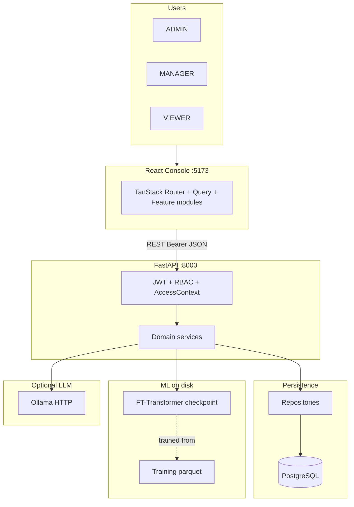
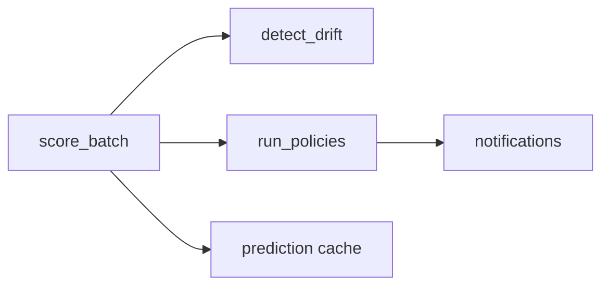

<div align="center">

# AssetFlow AI

### Enterprise Asset Lifecycle Intelligence Platform

**Full-stack · ML-powered · RBAC-secured · Operations-first**

Predict fleet health before failure. Act on AI recommendations in one console.  
Report to leadership in plain English — not spreadsheet noise.

<br/>

| FastAPI | React 19 | PostgreSQL | FT-Transformer | Ollama LLM | JWT + RBAC |
|:---:|:---:|:---:|:---:|:---:|:---:|

<br/>

[Architecture](#system-architecture) · [Backend](#backend-architecture) · [ML & FT-Transformer](#machine-learning--ft-transformer) · [AI Integration](#ai-integration) · [Quick Start](#quick-start) · [Demo](#demo-walkthrough)

</div>

---


> *"Built an end-to-end enterprise asset management platform . The backend is layered FastAPI with 35+ domain services, PostgreSQL, and Alembic migrations. The frontend is a production-style React 19 console with TanStack Router, role-based UI, and real-time analytics. Integrated a custom FT-Transformer model for health prediction, a tool-based AI assistant grounded in live SQL data, and optional Ollama LLM enhancement for executive reports — with graceful fallbacks when AI is offline."*

**What this demonstrates:** system design, API design, ML integration, security (JWT/RBAC), UX for enterprise users, and shipping a coherent product — not isolated tutorials.

---

## Impact at a glance

| Dimension | What you built |
|-----------|----------------|
| **API surface** | 15+ protected resource domains, OpenAPI-documented |
| **Backend services** | 35 specialized services (prediction, drift, assistant, reports, …) |
| **Frontend** | 10 routed screens, feature-sliced modules, 20+ dashboard components |
| **ML pipeline** | Synthetic data → ETL → FT-Transformer training → batch inference |
| **AI layer** | Tool-calling assistant + optional Ollama narrative enhancement |
| **Security** | 3 roles, 15 granular permissions, department access scoping |
| **Data** | 6 Alembic migrations, reproducible demo seed (200+ assets) |
| **Tests** | Pytest suite: auth, RBAC, health, access scope, reports |

---

## System architecture

One high-level map of how the pieces connect. Users hit the React console; every protected call goes through JWT validation and RBAC before any service or repository touches PostgreSQL. Intelligence work (scoring, drift, policies) runs in the FastAPI layer and calls the PyTorch model on disk — training data never lives in the operational database.



**How to read this:** The console is a thin client — it does not score assets locally. `PredictionService` loads `ml/artifacts/` weights, `FeatureEngineeringService` builds a feature row from live DB state (or sensible defaults for new assets), and results are cached in memory plus optionally persisted to `asset_health_history`. Ollama is a sidecar: reports and assistant phrasing can use it, but core fleet numbers always come from SQL + the transformer.

---

## Backend architecture

The backend follows a **strict layered design** so HTTP handlers stay thin and business rules stay testable. Nothing in `api/v1/endpoints` queries SQLAlchemy directly; nothing in `repositories` encodes JWT or role checks.

### Request lifecycle

Every protected route follows the same path:

1. **Middleware** — `RequestLoggingMiddleware` logs method, path, status, duration. CORS allows local Vite dev origins.
2. **Authentication** — `auth_deps.py` decodes the Bearer JWT (`security.py`), loads the `User`, and rejects expired or invalid tokens with 401.
3. **Authorization** — `enforce_rbac` checks the route’s required permission against `permissions.py` (role → permission map). `AccessContext` is built from the user’s role and department: ADMIN sees org-wide data; MANAGER and VIEWER are scoped to their department unless the resource is explicitly org-wide (e.g. lookups).
4. **Validation** — Pydantic schemas in `app/schemas/` validate request bodies and query params before the handler runs.
5. **Service delegation** — The endpoint calls one service method. Services orchestrate repositories, other services, and external calls (Ollama, filesystem model).
6. **Response mapping** — ORM entities or service dicts are returned as Pydantic response models for stable OpenAPI contracts.

`app/main.py` wires the app: lifespan hook starts `scheduler_service` (optional background intelligence pipeline), registers exception handlers, and mounts `api_router` at `/api/v1`. Health probes: `GET /health` (liveness), `GET /ready` (DB + ML artifact checks via `health_checks.py`).

### Layer responsibilities

| Layer | Location | Responsibility |
|-------|----------|----------------|
| **Presentation** | `api/v1/endpoints/*.py` | HTTP mapping, status codes, dependency injection |
| **Contracts** | `schemas/` | Request/response DTOs, enums shared with OpenAPI |
| **Application** | `services/` | Business rules, workflows, ML/LLM orchestration |
| **Infrastructure** | `repositories/` | Queries, filters, pagination, scope-aware SQL |
| **Persistence** | `models/` | SQLAlchemy 2.0 ORM, relationships, Alembic migrations |
| **Cross-cutting** | `core/` | Config, DB session, security, thresholds, enums |

### Domain services (grouped by concern)

**Asset lifecycle** — `asset_service`, `allocation_service`, `transfer_service`, `maintenance_service`, `maintenance_scheduling_service`, `health_history_service`, `timeline_service`. These enforce state transitions (e.g. cannot assign a retired asset), write audit-friendly records, and feed the timeline aggregator.

**Operations & dashboard** — `dashboard_service` builds KPIs, attention queues, and fleet summaries from scoped queries. `workspace_service` powers “My Workspace” (assigned assets, open maintenance for the logged-in employee). `notification_service` persists in-app alerts.

**Intelligence & ML** — `feature_engineering` extracts the frozen 10-column feature vector per asset. `prediction_service` runs inference, maps scores to risk tiers, warms an in-process cache (`get_prediction_cache()`), and optionally persists snapshots. `prediction_explanation_service` turns features + score deltas into human-readable factors (not SHAP — rule-based narratives aligned with ops thresholds). `recommendation_service`, `root_cause_service`, `priority_scoring`, `drift_monitoring_service`, and `policy_automation_service` sit on top of predictions and maintenance data. `intelligence_pipeline_service` runs the full batch: score → drift → policies → notifications.

**AI & narrative** — `assistant_service` + `assistant_intents` + `assistant_parsing` + `assistant_tools` implement grounded Q&A. `narrative.py` holds template strings for explanations and reports. `ollama_client.py` is a minimal async HTTP client to Ollama’s `/api/generate`. `reports_analytics_service` assembles executive analytics and optional LLM-enhanced narrative sections.

**Org & auth** — `auth_service`, `department_service`, `employee_service`, `report_service`, `cost_optimization_service`, `replacement_planning_service`, `knowledge_graph_service` (relationship hints for intelligence UX).

### Data access pattern

Repositories inherit shared pagination/filter helpers from `repositories/base.py`. `AssetRepository` and `DashboardRepository` accept `AccessContext` and add `WHERE department_id = …` (or skip for org-wide). This keeps **one source of truth for scoping** — the frontend never re-filters sensitive rows client-side.

### Configuration

`core/config.py` (Pydantic Settings) loads `.env`: `DATABASE_URL`, `JWT_SECRET_KEY`, `ML_ENABLED`, `ML_MODEL_PATH`, `ML_FEATURE_STATS_PATH`, `ASSISTANT_USE_OLLAMA`, `OLLAMA_BASE_URL`, `OLLAMA_MODEL`, `SCHEDULER_ENABLED`, etc. Feature flags let you run the demo with ML on and Ollama off.

### Core entities (relational model)

Departments own employees and assets. Users link to employees for identity. Assets have allocations (employee assignments), transfers (department moves), maintenance records, health history rows (ML snapshots), and notifications. Status enums (`AssetStatus`, `UserRole`, risk bands) live in `core/enums.py` and `core/health_thresholds.py` so API, ML, and UI share the same cutoffs.

---

## Machine learning & FT-Transformer

AssetFlow uses a **dual-dataset architecture**: PostgreSQL holds operational demo data (~200 assets for the app); **training data is file-based parquet** under `ml/artifacts/` and is never bulk-loaded into the OLTP database. That separation keeps inference fast, migrations simple, and training reproducible on a laptop or CI runner.

### End-to-end ML pipeline

| Stage | Command / module | Output |
|-------|------------------|--------|
| **Synthetic generation** | `py -m ml.data --rows 80000 --assets 9000` | Raw snapshots parquet (`synthetic_v1_80k`) |
| **ETL** | `py -m ml.etl --source file` | Normalized train/val/test splits + `feature_stats.json` |
| **Training** | `py -m ml.train` | `ft_transformer.pt` checkpoint + metrics report |
| **Operational seed** | `py -m app.seeding --profile demo --reset` | Demo DB with lifecycle history |
| **Inference** | API `score-batch` or `py -m ml.predict --asset-tag IT-LAP-0001` | Health score 0–1 + risk tier |

See [`ml/README.md`](ml/README.md) for the exact artifact paths and defaults.

### Feature schema (frozen contract)

`ml/data/schema.py` defines **10 input features** and one regression target. The same columns are produced by the synthetic generator, ETL normalization, database extraction, and live inference — preventing train/serve skew.

| Feature | Type | Meaning |
|---------|------|---------|
| `asset_type` | categorical | Laptop, Server, Printer, … (embedded in model) |
| `asset_age_days` | numeric | Days since purchase |
| `utilization_rate` | numeric | Operational hours / type-specific max (0–1) |
| `operational_hours` | numeric | Cumulative run hours |
| `maintenance_count` | numeric | Completed maintenance events |
| `days_since_last_maintenance` | numeric | Neglect signal |
| `failure_count` | numeric | Recorded failures |
| `downtime_hours` | numeric | Cumulative downtime |
| `allocation_count` | numeric | Assignment churn proxy |
| `transfer_count` | numeric | Inter-department moves |

**Label:** `health_score` ∈ [0, 1]. **Risk tiers** for ops (LOW / MEDIUM / HIGH) are derived post-prediction via `core/health_thresholds.py` (e.g. LOW ≥ 0.70, MEDIUM ≥ 0.50, else HIGH). Five-band fleet health (Excellent → Critical) uses finer UI cutoffs on the same score.

### Synthetic training data (why it exists)

`ml/data/synthetic_generator.py` simulates **causal asset lifecycles** over months: purchase, utilization accumulation, maintenance events, failures, allocations, transfers. Per-type wear curves live in `ml/data/type_profiles.py` (expected life, max hours, baseline downtime). Health is computed with an explicit formula (age, utilization, neglect, failures, downtime, mobility, maintenance bonus, small Gaussian noise) so the model learns patterns that mirror the domain — not random labels. This yields ~80k labeled snapshots across ~9k synthetic assets without exposing real customer data.

### ETL and normalization

`ml/etl/features.py` fits **per-column mean/std** on numeric features and builds a stable `asset_type` → index map. At inference, `vectorize_row()` applies the same z-score using saved `feature_stats.json`. Unknown asset types map to index 0. `FeatureEngineeringService` in the app either pulls the latest row from `DatabaseSource` (health history–backed features) or `_default_features_for_asset()` when history is sparse — so new demo assets still get a valid vector.

### Training loop (`ml/train.py`)

- **Loss:** MSE on continuous health score (regression, not classification).
- **Optimizer:** AdamW, weight decay 1e-4, default 30 epochs, batch 512.
- **Splits:** train / val / test from ETL parquet; early stopping on validation loss (patience 5).
- **Metrics:** MAE, RMSE, and **risk-tier accuracy** (fraction where predicted tier matches true tier after thresholding).
- **Checkpoint** stores `model_state`, `n_numeric`, `n_categories`, `model_version`, `training_dataset` for load-time reconstruction.

Operational inference is **CPU-friendly** (`map_location="cpu"`, `torch.no_grad()`).

### Inference in production (`prediction_service.py`)

1. Guard: `ML_ENABLED` must be true.
2. Load asset via `AssetService` (scoped).
3. `extract_asset_features(asset_id)` → feature dict.
4. `predict_from_features()` loads checkpoint + stats, runs forward pass, returns score, risk, confidence heuristic, metadata.
5. Optional `HealthHistoryService.create()` persists snapshot with `prediction_metadata` JSON.
6. `score_batch()` scores all in-scope assets, updates cache, powers dashboard fleet bands and recommendations.

**Confidence** (in `ml/predict.py`) is a simple distance-from-0.5 heuristic — not a calibrated probability — documented so consumers treat it as a relative signal, not actuarial certainty.

### Explainability

`PredictionExplanationService` does **not** use attention weights from the transformer. Instead it applies **operations rules** on the same features the model saw: sudden health drop vs previous snapshot, risk escalation, high failure count, overdue maintenance (threshold varies by asset type), high utilization, etc. Messages come from `narrative.py`. This gives auditors traceable reasons alongside the black-box score.

---

## FT-Transformer — technical deep dive

The model is **`FTTransformer`** in `ml/models/ft_transformer.py`, implementing the *Feature Tokenizer + Transformer* idea for **tabular data**: each column becomes a token; self-attention learns interactions between features (e.g. high `failure_count` amplifying effect of `days_since_last_maintenance`).

### Why a transformer for tabular health?

Gradient-boosted trees excel on many tabular benchmarks, but a small transformer offers:

- A **unified path** for mixed numeric + categorical inputs without hand-built crossing features.
- **Attention** over feature tokens — interpretable in research settings (this project uses rule-based explanations for production clarity).
- A clear story for interviews: custom PyTorch module, training loop, checkpointing, and FastAPI integration — not a wrapper around a third-party AutoML API.

### Architecture (forward pass)

**Hyperparameters (defaults):** `d_token=64`, `n_heads=4`, `n_layers=3`, `dropout=0.1`, FFN dim = `4 × d_token`, activation GELU.

**Token construction:**

1. **CLS token** — learnable `[1, 1, d_token]` prepended like BERT; the regression head reads `encoded[:, 0]`.
2. **Categorical token** — `asset_type` → `nn.Embedding(n_categories, d_token)` → shape `(B, 1, d_token)`.
3. **Numeric tokens** — each of the 9 numeric features is projected independently: `nn.Linear(1, d_token)` on `numeric.unsqueeze(-1)` → `(B, 9, d_token)`.

**Sequence:** `tokens = concat([CLS, cat_token, num_tokens], dim=1)` → length **11** (1 + 1 + 9).

**Encoder:** standard `nn.TransformerEncoderLayer` stack (`batch_first=True`), self-attention across all feature tokens so, for example, `operational_hours` and `utilization_rate` can attend to each other.

**Head:** `LayerNorm → Linear(d_token, d_token/2) → GELU → Dropout → Linear(d_token/2, 1) → Sigmoid` → output in **(0, 1)** matching health score scale.

```text
  [CLS] [asset_type] [age] [util] [hours] [maint#] [days_since] [failures] [downtime] [alloc] [transfer]
    |       |         |     |      |        |          |            |          |         |        |
    +-------+---------+-----+------+--------+----------+------------+----------+---------+--------+
                                    TransformerEncoder × 3
                                              |
                                         CLS vector
                                              |
                                    MLP head → σ → health_score
```

### Training vs inference parity

Training uses precomputed `{col}_norm` columns and `asset_type_idx` in the parquet loader (`TabularDataset`). Inference uses `vectorize_row()` with the **same** stats file written at ETL time. If you retrain, you must redeploy both `.pt` and `feature_stats.json` together.

### Model artifacts

Default paths (overridable via env): model weights, feature stats, training report JSON. The readiness probe can verify artifacts exist when `ML_ENABLED=true` so orchestrators do not route traffic to a broken inference path.

---

## AI integration

“AI” in AssetFlow is **three distinct systems** — do not conflate them:

| System | Grounding | Optional LLM | Primary output |
|--------|-----------|--------------|----------------|
| **Health ML** | SQL features → FT-Transformer | No | Numeric score + risk tier |
| **Assistant** | SQL via tool functions | Yes (phrasing) | Answer + `sources` |
| **Reports** | Aggregated analytics services | Yes (executive rewrite) | Narrative sections + charts |

All three degrade gracefully when Ollama is down.

### Intelligence pipeline (batch ops)

When an ADMIN/MANAGER clicks **Run AI pipeline** (or the scheduler fires), `IntelligencePipelineService.run_full_pipeline()` runs:



**Explanation:** `score_batch` runs FT-Transformer on every in-scope asset, optionally writing `asset_health_history`. `DriftMonitoringService` compares new scores to prior snapshots and raises alerts when health drops beyond thresholds. `PolicyAutomationService` evaluates rules (high risk, maintenance due, positive trends) and creates notifications. The in-memory prediction cache is warmed so dashboard KPIs and fleet donuts update without re-inferring on every page load.

### AI assistant (grounded, not generative-first)

Flow: **parse → classify intent → execute DB tool → template response → optional Ollama polish**.

- **`assistant_parsing.py`** — extracts asset tags, employee names, session context, follow-up detection (“explain those”, “why them”).
- **`assistant_intents.py`** — regex/keyword classifiers for fleet counts, high-risk lists, maintenance queues, warranty windows, department rankings, etc.
- **`assistant_tools.py`** — synchronous functions that call repositories/services and return **structured JSON** (counts, rows, sources). The LLM never fabricates asset tags or counts.
- **`assistant_service.chat()`** — dispatches tools on a thread pool (`asyncio.to_thread`), builds `AssistantChatResponse` with `tools_used` and `sources` for transparency. If `ASSISTANT_USE_OLLAMA` is true, a short prompt asks Ollama to tighten phrasing **without changing numbers**; on timeout/error, the template answer is returned.

This design prioritizes **correctness over fluency** — appropriate for enterprise ops chat.

### Ollama client

`ollama_client.ollama_generate()` POSTs to `{OLLAMA_BASE_URL}/api/generate` with `model`, `prompt`, `stream: false`. Used by assistant formatting and reports. No streaming in v1 — simpler error handling and timeouts (`ollama_timeout_seconds`).

### Executive reports (standard vs enhanced)

`ReportsAnalyticsService.build()` aggregates dashboard metrics, recommendations, drift, replacement plan, cost analytics, and maintenance schedule into `ReportsAnalyticsResponse`.

- **`use_ai=false` (standard):** Template-driven `ReportInsightSection` blocks from computed metrics — deterministic, fast, printable.
- **`use_ai=true` (enhanced, ADMIN/MANAGER):** Builds a prompt from the same metrics; `ollama_generate()` rewrites executive summary sections. If Ollama fails or returns empty, `_simplify_executive_sections()` fills **enhanced_template** fallback so the UI still shows a narrative (`source` field lets the frontend badge “AI” vs “Template”).

Frontend (`reports.tsx`) loads analytics in the left column and narrative on the right with skeleton → swap when narrative arrives.

### Recommendations, drift, and policies (non-LLM intelligence)

- **`recommendation_service`** — ranks actions (maintenance, replacement) from scores + maintenance data.
- **`drift_monitoring_service`** — snapshot-to-snapshot health delta alerts.
- **`policy_automation_service`** — emits HIGH/MEDIUM notifications for escalations and positive outcomes.
- **`cost_optimization_service` / `replacement_planning_service`** — planning analytics for reports and asset detail tabs.

These services use the **prediction cache** and DB state, not an LLM.

---

## Repository structure

<details>
<summary><strong>Click to expand — monorepo tree</strong></summary>

```
AssetFlow-AI/
├── app/                          # FastAPI backend (api, core, models, repositories, schemas, services)
├── frontend/                     # React 19 + TanStack Router/Query
├── ml/                           # FT-Transformer training, ETL, synthetic data, predict CLI
├── alembic/versions/             # Schema migrations 001–006
├── tests/                        # Pytest (auth, RBAC, scope, health, reports)
├── docs/                         # DEMO.md, FRONTEND_ARCHITECTURE.md
├── scripts/dev/                  # Routing, RBAC, assistant diagnostics
├── requirements.txt
├── requirements-ml.txt
└── .env.example
```

Key backend entrypoints: `app/main.py`, `app/api/v1/router.py`, `app/services/prediction_service.py`, `app/services/assistant_service.py`, `app/services/intelligence_pipeline_service.py`.

Key ML entrypoints: `ml/models/ft_transformer.py`, `ml/train.py`, `ml/predict.py`, `ml/data/schema.py`.

</details>

---

## Frontend (summary)

React 19 console with **feature-sliced** modules under `frontend/src/features/`. TanStack Router file routes in `routes/`; TanStack Query hooks in each feature’s `api.ts` / `hooks.ts`. `lib/adapters/` maps backend DTOs to UI types. `lib/api.ts` attaches JWT from `auth-context`. Route guards enforce login and password-change flows.

**Operations Center** (`dashboard.tsx`): My Workspace → KPIs → Fleet Health / Attention / Feed → Analytics → Recommendations → charts → Quick Actions → AI Engine status. `useFleetHealthStats` merges dashboard summary with intelligence cache so fleet bands stay accurate after pipeline runs.

**Notable UX:** CSS 3D login hero (`enterprise-hero.tsx`), asset type preview modal (`asset-type-visual.tsx`), profile dropdown, dark-theme chart tooltips, reports print layout.

Deeper screen-to-API mapping: [`docs/FRONTEND_ARCHITECTURE.md`](docs/FRONTEND_ARCHITECTURE.md).

---

## Tech stack

| Layer | Stack |
|-------|-------|
| API | FastAPI, Pydantic v2, Uvicorn |
| Data | PostgreSQL, SQLAlchemy 2, Alembic |
| Security | JWT, bcrypt, RBAC, `AccessContext` |
| Frontend | React 19, TypeScript, Vite, TanStack Router & Query |
| UI | Tailwind v4, Radix UI, Recharts |
| ML | PyTorch, custom FT-Transformer |
| LLM | Ollama (optional, local) |

---

## API surface

| Domain | Key endpoints |
|--------|---------------|
| Auth | `POST /auth/login` · `GET /auth/me` · `POST /auth/change-password` |
| Assets | CRUD · search · filters |
| Lifecycle | allocations · transfers · maintenance · health-history · timeline |
| Dashboard | `GET /dashboard/summary` · `GET /dashboard/my-workspace` |
| Intelligence | predict · score-batch · recommendations · high-risk · cache-status |
| Assistant | `POST /assistant/chat` |
| Operations | reports analytics · pipeline run/status · notifications |
| Org | departments · employees · lookups |

**Swagger:** `http://localhost:8000/docs`

---

## Role matrix

| Capability | ADMIN | MANAGER | VIEWER |
|:-----------|:-----:|:-------:|:------:|
| Org-wide data | ✓ | — | — |
| Department scope | ✓ | ✓ | ✓ |
| Write assets / maintenance | ✓ | ✓ | — |
| Run AI pipeline | ✓ | ✓ | — |
| Enhanced reports (`use_ai`) | ✓ | ✓ | — |
| AI assistant | ✓ | ✓ | ✓ |
| Manage departments/employees | ✓ | — | — |

---

## Quick start

### Prerequisites

Python 3.11+ · Node 20+ · PostgreSQL · (optional) Ollama · (optional) `requirements-ml.txt` for training

### Backend

```bash
cp .env.example .env
pip install -r requirements.txt
alembic upgrade head
python -m app.seeding --profile demo --reset
uvicorn app.main:app --reload
```

### Frontend

```bash
cd frontend
cp .env.example .env
npm install
npm run dev
```

### ML training (optional)

```bash
pip install -r requirements-ml.txt
py -m ml.data --rows 80000 --assets 9000 --seed 42
py -m ml.etl --source file
py -m ml.train
```

### Ollama (optional)

```bash
ollama pull llama3.2:3b
# .env: ASSISTANT_USE_OLLAMA=true, OLLAMA_MODEL=llama3.2:3b
```

---

## Demo walkthrough

| Step | Action |
|------|--------|
| 1 | Login as seeded ADMIN — enterprise hero on login page |
| 2 | Operations Center → **Run AI pipeline** → watch KPIs and fleet health update |
| 3 | Click a high-risk asset → 3D type preview modal |
| 4 | Open `IT-LAP-0001` → lifecycle tabs + Intelligence assessment |
| 5 | Assistant: “Which assets are high risk?” — verify sources in response |
| 6 | Reports → toggle **Enhanced analysis** (badge shows AI vs template if Ollama off) |

| Demo asset | Tag | Show |
|------------|-----|------|
| Laptop | `IT-LAP-0001` | Lifecycle + intelligence |
| Server | `SRV-PROD-01` | High-risk / server visual |
| Printer | `ADM-PRT-001` | Maintenance recommendations |

Full script: [`docs/DEMO.md`](docs/DEMO.md)

---

## Testing

```bash
pytest tests/ -v
cd frontend && npx tsc --noEmit && npm run build
```

| Module | Covers |
|--------|--------|
| `test_auth_integration.py` | login, JWT, password change |
| `test_permissions.py` | role permission matrix |
| `test_access_scope.py` | department scoping |
| `test_health.py` | /health, /ready |
| `test_reports_analytics_benchmarks.py` | executive report data |

---

## Environment variables

| Variable | Purpose |
|----------|---------|
| `DATABASE_URL` | PostgreSQL connection |
| `JWT_SECRET_KEY` | Token signing |
| `ML_ENABLED` | Gate inference endpoints |
| `ML_MODEL_PATH` / `ML_FEATURE_STATS_PATH` | Deployed artifacts |
| `ASSISTANT_USE_OLLAMA` | LLM polish for assistant/reports |
| `OLLAMA_BASE_URL` / `OLLAMA_MODEL` | Ollama server + model tag |
| `SCHEDULER_ENABLED` | Background intelligence pipeline |
| `VITE_API_BASE_URL` | Frontend API base |

---

## Design principles

1. **Operations-first** — attention queues and next actions, not vanity metrics  
2. **Scoped truth** — department filter enforced in SQL, not UI-only  
3. **AI with accountability** — scores from model; words from templates or cited tools; LLM optional  
4. **Layered & testable** — thin handlers, fat services, isolated repositories  
5. **Demo-resilient** — works without Ollama; reports and assistant fall back to templates  

---

## Documentation index

| Doc | Purpose |
|-----|---------|
| [`docs/DEMO.md`](docs/DEMO.md) | Step-by-step demo script |
| [`docs/FRONTEND_ARCHITECTURE.md`](docs/FRONTEND_ARCHITECTURE.md) | Screen-to-API blueprint |
| [`ml/README.md`](ml/README.md) | ML commands and artifact layout |
| [`scripts/dev/README.md`](scripts/dev/README.md) | Diagnostic scripts |
| [`deploy/DEPLOY_AWS.md`](deploy/DEPLOY_AWS.md) | AWS Option A deploy (no Docker) |

---

<div align="center">

**AssetFlow AI** — full-stack ownership from schema design to FT-Transformer inference and grounded AI assistant.

</div>
