<div align="center">

# AssetFlow AI

### Enterprise Asset Lifecycle Intelligence Platform

**Full-stack · ML-powered · RBAC-secured · Operations-first**

Predict fleet health before failure. Act on AI recommendations in one console.  
Report to leadership in plain English — not spreadsheet noise.

<br/>

| FastAPI | React 19 | PostgreSQL | FT-Transformer | Ollama LLM | JWT + RBAC |
|:---:|:---:|:---:|:---:|:---:|:---:|

<br/>

[Architecture](#-system-architecture) · [File Structure](#-complete-repository-structure) · [Features](#-feature-deep-dive) · [Diagrams](#-visual-system-maps) · [Quick Start](#-quick-start) · [Demo](#-demo-walkthrough)

</div>

---

## The 30-second pitch (for recruiters & hiring managers)

> *"I built an end-to-end enterprise asset management platform — not a todo app. The backend is layered FastAPI with 35+ domain services, PostgreSQL, and Alembic migrations. The frontend is a production-style React 19 console with TanStack Router, role-based UI, and real-time analytics. I integrated a custom FT-Transformer model for health prediction, a tool-based AI assistant grounded in live SQL data, and optional Ollama LLM enhancement for executive reports — with graceful fallbacks when AI is offline."*

**What this demonstrates:** system design, API design, ML integration, security (JWT/RBAC), UX for enterprise users, and shipping a coherent product — not isolated tutorials.

---

## Impact at a glance

| Dimension | What you built |
|-----------|----------------|
| **API surface** | 15+ protected resource domains, OpenAPI-documented |
| **Backend services** | 35 specialized services (prediction, drift, assistant, reports, …) |
| **Frontend** | 10 routed screens, feature-sliced modules, 20+ dashboard components |
| **ML pipeline** | Synthetic data → ETL → FT-Transformer training → batch inference |
| **AI layer** | Tool-calling assistant + optional Ollama narrative enhancement |
| **Security** | 3 roles, 15 granular permissions, department access scoping |
| **Data** | 6 Alembic migrations, reproducible demo seed (200+ assets) |
| **Tests** | Pytest suite: auth, RBAC, health, access scope, reports |

---

## System architecture

### End-to-end platform map

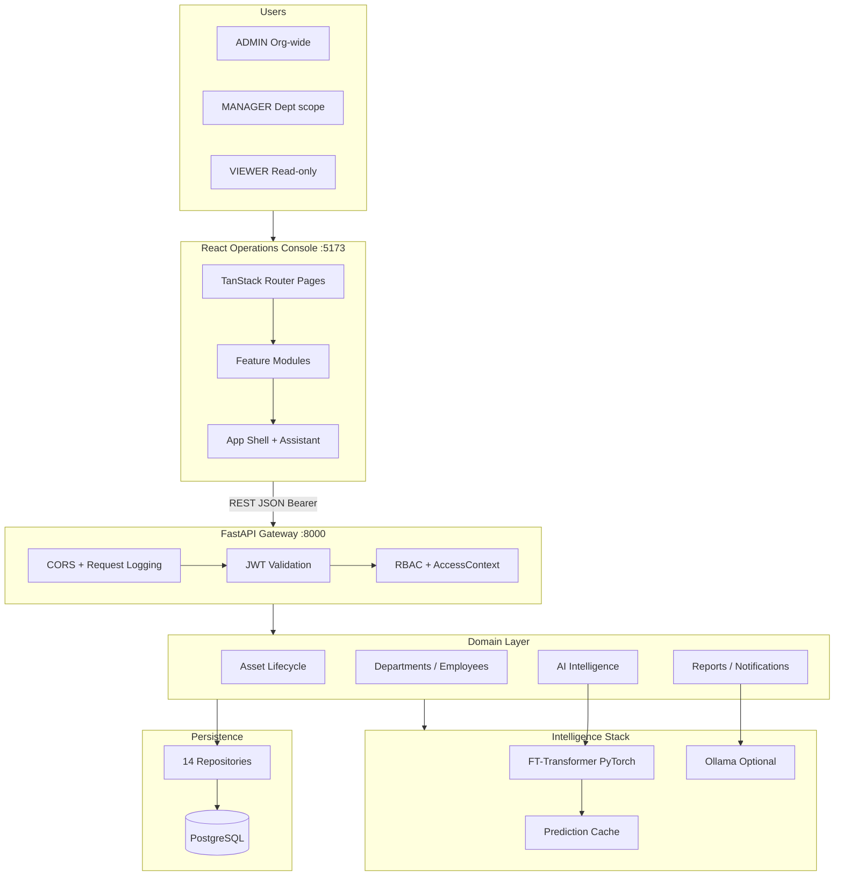

### Layered backend design (clean architecture)

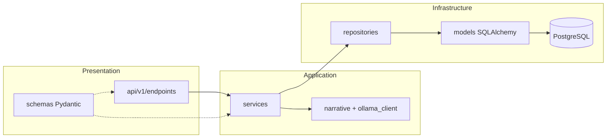

Every HTTP handler stays thin: **validate → authorize → delegate → respond**.

---

## Complete repository structure

<details>
<summary><strong>Click to expand — full monorepo tree</strong></summary>

```
AssetFlow-AI/
│
├── app/                                    # ═══ BACKEND (FastAPI) ═══
│   ├── main.py                             # App factory, CORS, lifespan scheduler
│   ├── api/
│   │   ├── auth_deps.py                    # JWT, RBAC, AccessContext injection
│   │   ├── deps.py                         # Shared FastAPI dependencies
│   │   └── v1/
│   │       ├── router.py                   # Public auth + protected router mount
│   │       └── endpoints/
│   │           ├── auth.py                 # login, me, change-password
│   │           ├── assets.py               # CRUD, search, filters
│   │           ├── allocations.py          # assign, return, reassign
│   │           ├── transfers.py            # inter-department moves
│   │           ├── maintenance.py          # maintenance records
│   │           ├── health_history.py       # health snapshots
│   │           ├── timeline.py             # unified asset timeline
│   │           ├── dashboard.py            # summary, my-workspace
│   │           ├── departments.py          # org units CRUD
│   │           ├── employees.py            # workforce CRUD
│   │           ├── lookups.py              # asset types, categories
│   │           ├── intelligence.py         # predict, score-batch, recommendations
│   │           ├── assistant.py            # chat endpoint
│   │           └── operations.py           # reports, pipeline, notifications
│   │
│   ├── core/
│   │   ├── config.py                       # pydantic-settings (.env)
│   │   ├── database.py                     # SQLAlchemy session
│   │   ├── security.py                     # JWT + bcrypt
│   │   ├── permissions.py                  # role → permission map
│   │   ├── access_scope.py                 # department/org scoping
│   │   ├── health_thresholds.py            # risk band cutoffs
│   │   ├── health_checks.py                # /ready probe
│   │   ├── password_policy.py              # strength validation
│   │   └── enums.py                        # AssetStatus, UserRole, …
│   │
│   ├── models/                             # SQLAlchemy ORM (10 entities)
│   │   ├── asset.py, allocation.py, transfer.py
│   │   ├── maintenance.py, health_history.py
│   │   ├── department.py, employee.py, user.py
│   │   └── notification.py
│   │
│   ├── repositories/                       # Data access (14 repos)
│   │   ├── asset_repository.py
│   │   ├── dashboard_repository.py
│   │   ├── timeline_repository.py
│   │   └── …
│   │
│   ├── schemas/                            # Pydantic DTOs (request/response)
│   │   ├── asset.py, dashboard.py, intelligence.py
│   │   ├── assistant.py, reports_analytics.py
│   │   └── workspace.py, …
│   │
│   ├── services/                           # ★ 35 BUSINESS SERVICES ★
│   │   ├── asset_service.py                # asset CRUD + rules
│   │   ├── allocation_service.py           # assign/return workflows
│   │   ├── transfer_service.py
│   │   ├── maintenance_service.py
│   │   ├── maintenance_scheduling_service.py
│   │   ├── health_history_service.py
│   │   ├── timeline_service.py
│   │   ├── dashboard_service.py            # KPIs, attention items
│   │   ├── workspace_service.py            # my-workspace payload
│   │   ├── department_service.py
│   │   ├── employee_service.py
│   │   ├── auth_service.py
│   │   ├── notification_service.py
│   │   ├── prediction_service.py           # FT-Transformer inference
│   │   ├── prediction_explanation_service.py
│   │   ├── feature_engineering.py        # ML feature vectors
│   │   ├── recommendation_service.py
│   │   ├── root_cause_service.py
│   │   ├── intelligence_pipeline_service.py  # score→drift→policy
│   │   ├── drift_monitoring_service.py
│   │   ├── policy_automation_service.py  # alert rules
│   │   ├── priority_scoring.py
│   │   ├── reports_analytics_service.py    # executive report builder
│   │   ├── report_service.py
│   │   ├── cost_optimization_service.py
│   │   ├── replacement_planning_service.py
│   │   ├── knowledge_graph_service.py
│   │   ├── assistant_service.py            # chat orchestration
│   │   ├── assistant_tools.py              # DB-backed tool functions
│   │   ├── assistant_intents.py            # intent classification
│   │   ├── assistant_parsing.py            # entity extraction
│   │   ├── narrative.py                    # plain-English templates
│   │   ├── ollama_client.py                # LLM HTTP client
│   │   └── scheduler_service.py            # background pipeline
│   │
│   ├── middleware/request_logging.py
│   ├── exceptions/handlers.py
│   └── seeding/                            # Demo data generator
│       ├── generator.py                    # 200 assets, 18mo history
│       ├── profiles.py, manifest.py
│       └── users.py                        # seeded RBAC accounts
│
├── frontend/                               # ═══ FRONTEND (React 19) ═══
│   ├── src/
│   │   ├── routes/                         # ★ TANSTACK FILE ROUTES ★
│   │   │   ├── __root.tsx
│   │   │   ├── index.tsx                   # redirect auth/dashboard
│   │   │   ├── login.tsx                   # + EnterpriseHero 3D CSS
│   │   │   ├── change-password.tsx
│   │   │   ├── _app.tsx                    # Auth layout + AssetPreviewProvider
│   │   │   └── _app/
│   │   │       ├── dashboard.tsx           # Operations Center
│   │   │       ├── assets.tsx              # layout + Outlet
│   │   │       ├── assets.index.tsx        # asset table
│   │   │       ├── assets.$id.tsx          # detail tabs + intelligence
│   │   │       ├── maintenance.tsx
│   │   │       ├── departments.tsx
│   │   │       ├── employees.tsx
│   │   │       ├── reports.tsx             # 60/40 analytics + narrative
│   │   │       └── settings.tsx
│   │   │
│   │   ├── features/                       # ★ FEATURE-SLICED MODULES ★
│   │   │   ├── auth/
│   │   │   │   ├── api.ts, permissions.ts, use-permissions.ts
│   │   │   │   └── components/
│   │   │   │       ├── user-profile-menu.tsx
│   │   │   │       └── enterprise-hero.tsx
│   │   │   ├── dashboard/
│   │   │   │   ├── api.ts, hooks.ts
│   │   │   │   ├── hooks/use-fleet-health-stats.ts
│   │   │   │   └── components/
│   │   │   │       ├── my-workspace-hero.tsx
│   │   │   │       ├── kpi-strip.tsx
│   │   │   │       ├── fleet-health-hero.tsx
│   │   │   │       ├── needs-attention-panel.tsx
│   │   │   │       ├── operations-feed.tsx
│   │   │   │       ├── analytics-overview-row.tsx
│   │   │   │       ├── ai-recommendations-row.tsx
│   │   │   │       ├── priority-alerts-panel.tsx
│   │   │   │       ├── ai-engine-status.tsx
│   │   │   │       ├── quick-actions-panel.tsx
│   │   │   │       ├── dept-allocation-chart.tsx
│   │   │   │       ├── chart-card.tsx
│   │   │   │       └── dashboard-styles.ts
│   │   │   ├── assets/
│   │   │   │   ├── api.ts, hooks.ts, lifecycle-api.ts
│   │   │   │   ├── asset-preview-context.tsx
│   │   │   │   └── components/
│   │   │   │       ├── asset-form-dialog.tsx
│   │   │   │       ├── asset-health-analysis.tsx
│   │   │   │       ├── asset-health-trend-chart.tsx
│   │   │   │       ├── asset-type-visual.tsx      # CSS 3D spin
│   │   │   │       ├── asset-preview-dialog.tsx
│   │   │   │       └── lifecycle-action-sheets.tsx
│   │   │   ├── intelligence/               # api.ts, hooks.ts
│   │   │   ├── operations/                 # reports, pipeline, notifications
│   │   │   ├── departments/
│   │   │   ├── employees/
│   │   │   └── maintenance/
│   │   │
│   │   ├── components/
│   │   │   ├── app-shell.tsx               # nav, assistant, notifications, profile
│   │   │   ├── ui-bits.tsx                 # Card, Pill, Skeleton
│   │   │   └── ui/                         # shadcn/Radix primitives (40+)
│   │   │
│   │   ├── lib/
│   │   │   ├── api.ts                      # fetch + JWT header
│   │   │   ├── auth-context.tsx
│   │   │   ├── route-guards.ts
│   │   │   ├── chart-theme.ts, chart-tooltip.tsx
│   │   │   ├── adapters/                   # API → UI type mapping
│   │   │   │   ├── dashboard.ts, reports.ts
│   │   │   │   ├── assets.ts, notifications.ts
│   │   │   └── types/                      # backend.ts, ui.ts
│   │   │
│   │   ├── router.tsx
│   │   └── routeTree.gen.ts
│   │
│   ├── package.json
│   └── vite.config.ts
│
├── ml/                                     # ═══ MACHINE LEARNING ═══
│   ├── models/ft_transformer.py            # Feature-tokenization transformer
│   ├── train.py                            # training loop
│   ├── predict.py                          # inference entry
│   ├── etl/
│   │   ├── features.py                     # feature engineering
│   │   ├── dataset.py
│   │   └── sources/                        # parquet, database
│   └── data/
│       ├── synthetic_generator.py          # enterprise-scale synthetic data
│       └── type_profiles.py                # per-asset-type wear curves
│
├── alembic/versions/                       # 001–006 schema migrations
├── tests/                                  # pytest: auth, RBAC, health, reports
├── docs/
│   ├── DEMO.md                             # 5-minute demo script
│   └── FRONTEND_ARCHITECTURE.md
├── scripts/dev/                            # routing, RBAC, assistant diagnostics
├── requirements.txt
├── .env.example
└── README.md                               # ← you are here
```

</details>

---

## Visual system maps

### 1. Asset lifecycle state machine

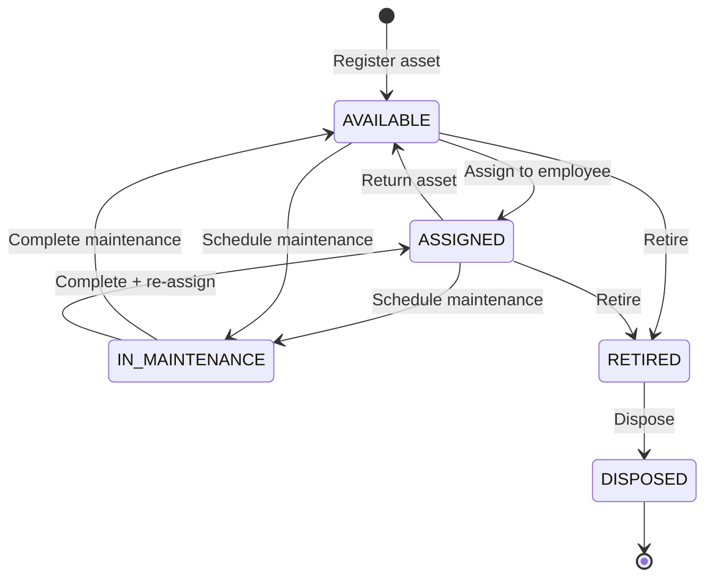

### 2. Operations Center — screen composition

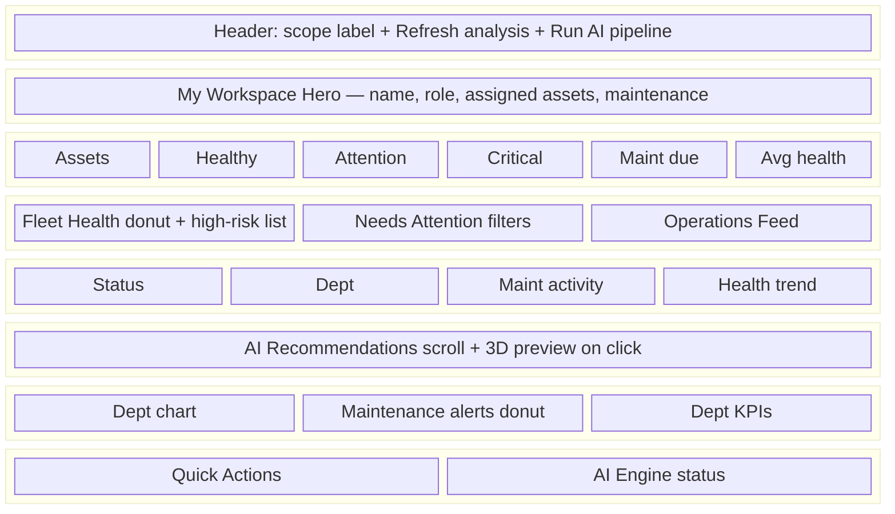

### 3. Intelligence pipeline (what happens when you click "Run AI pipeline")

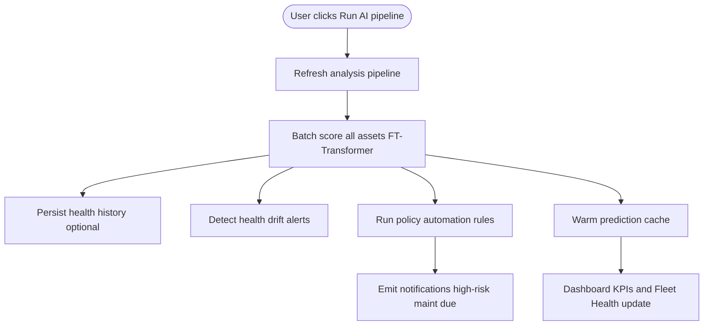

### 4. AI Assistant — grounded answers (not hallucinations)

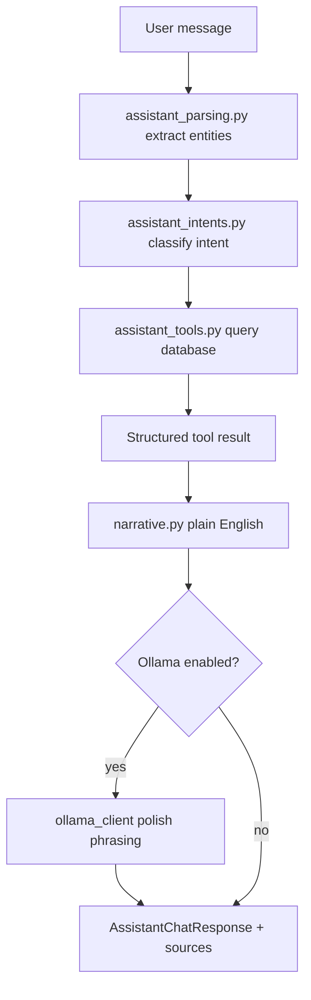

### 5. Reports — standard vs enhanced narrative

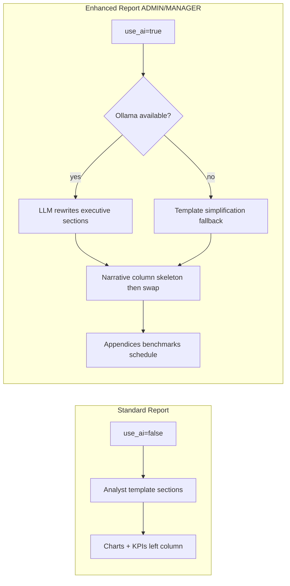

### 6. Authentication and RBAC flow

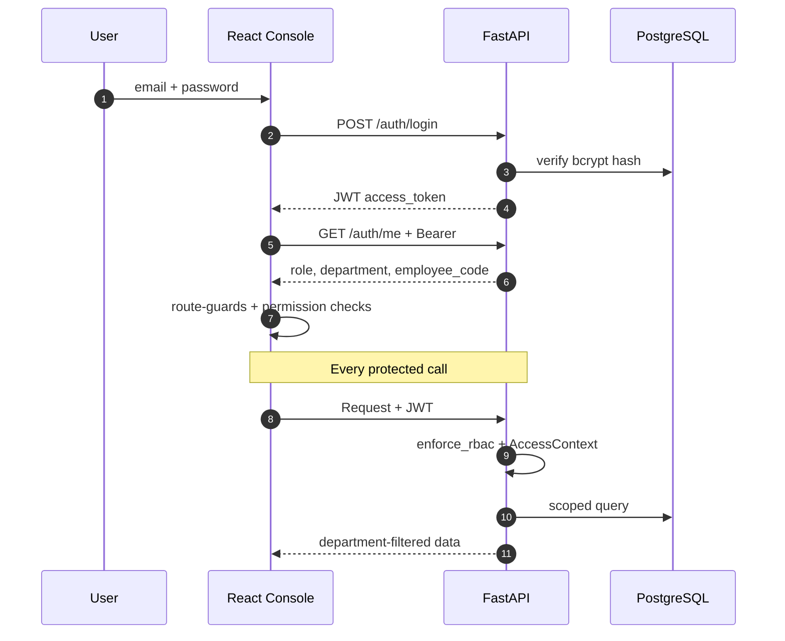

### 7. Data model (core entities)

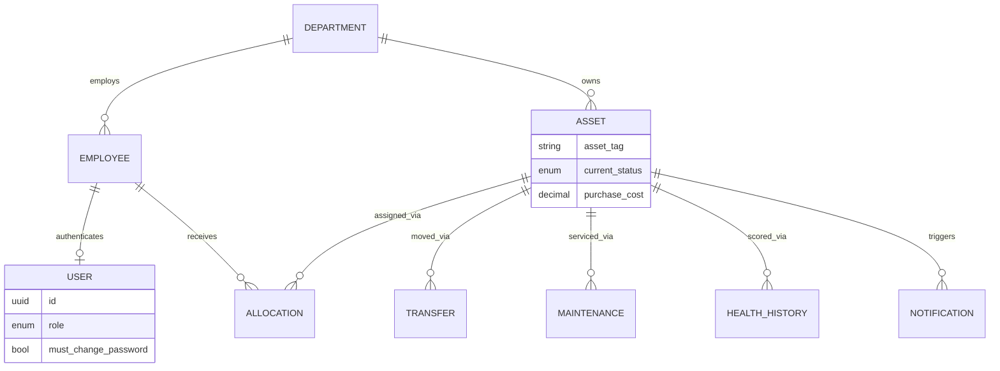

### 8. Frontend data flow (TanStack Query)

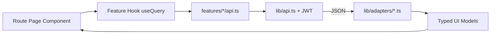

---

## Feature deep dive

### Operations Center — every segment explained

| # | Component | What it does | Key implementation |
|---|-----------|--------------|-------------------|
| 1 | **My Workspace Hero** | First thing users see — personal context | `my-workspace-hero.tsx` + `GET /dashboard/my-workspace` |
| 2 | **KPI Strip** | 6 fleet metrics with sparkline subtitles | `kpi-strip.tsx` + `useFleetHealthStats` |
| 3 | **Fleet Health Hero** | Risk-band donut + top high-risk assets | `fleet-health-hero.tsx`; click → 3D preview modal |
| 4 | **Needs Attention** | Filterable action queue by item type | `needs-attention-panel.tsx` |
| 5 | **Operations Feed** | Last N lifecycle events | `operations-feed.tsx` |
| 6 | **Analytics Row** | 4 charts: status, dept, maintenance, health | `analytics-overview-row.tsx` + Recharts |
| 7 | **AI Recommendations** | Horizontal scroll cards from ML engine | `ai-recommendations-row.tsx` |
| 8 | **Maintenance & Alerts** | Donut by attention category | `priority-alerts-panel.tsx` |
| 9 | **Quick Actions** | Register asset, schedule maint, etc. | `quick-actions-panel.tsx` |
| 10 | **AI Engine Status** | Cache warm/cold, scored count, last run | `ai-engine-status.tsx` + pipeline API |

**Engineering highlight:** `useFleetHealthStats` merges dashboard summary + intelligence cache + high-risk API so fleet bands never show zeros when data exists in cache.

---

### Asset detail — tab architecture

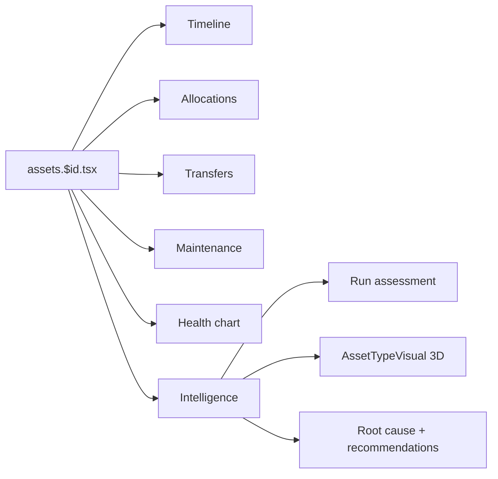

---

### Premium UX you implemented

| Experience | Technology | User benefit |
|------------|------------|--------------|
| Login **Enterprise Hero** | CSS 3D `rotateY` orbit | Brand story before sign-in |
| **Asset 3D Preview** | CSS perspective + type mapping | Instant recognition (laptop vs server rack) |
| **Glass cards** | Tailwind + `glassCardClass()` | Premium ops-console aesthetic |
| **Profile dropdown** | Radix DropdownMenu | Identity + settings without leaving page |
| **Chart legends** | `ChartTooltip` + static legend | Readable on dark theme |
| **Reports print layout** | CSS print breakpoints | Executive-ready PDF via browser |

---

## Tech stack

<table>
<tr><th>Layer</th><th>Stack</th><th>Why it matters to recruiters</th></tr>
<tr><td><strong>API</strong></td><td>FastAPI, Pydantic v2, Uvicorn</td><td>Modern async Python, auto OpenAPI docs</td></tr>
<tr><td><strong>Data</strong></td><td>PostgreSQL, SQLAlchemy 2, Alembic</td><td>Production persistence patterns</td></tr>
<tr><td><strong>Security</strong></td><td>JWT, bcrypt, RBAC, access scoping</td><td>Enterprise-grade auth design</td></tr>
<tr><td><strong>Frontend</strong></td><td>React 19, TypeScript, Vite 6</td><td>Current industry standard</td></tr>
<tr><td><strong>Routing</strong></td><td>TanStack Router (file-based)</td><td>Type-safe routes, code splitting</td></tr>
<tr><td><strong>State</strong></td><td>TanStack Query</td><td>Server cache, invalidation, loading UX</td></tr>
<tr><td><strong>UI</strong></td><td>Tailwind v4, Radix UI, Recharts</td><td>Accessible components + data viz</td></tr>
<tr><td><strong>ML</strong></td><td>PyTorch FT-Transformer</td><td>Real model — not hardcoded scores</td></tr>
<tr><td><strong>LLM</strong></td><td>Ollama (optional)</td><td>Local LLM — no API key required for demo</td></tr>
</table>

---

## API surface

| Domain | Key endpoints |
|--------|---------------|
| **Auth** | `POST /auth/login` · `GET /auth/me` · `POST /auth/change-password` |
| **Assets** | CRUD · search · filters by dept/status |
| **Lifecycle** | assign · return · transfer · maintenance · health-history |
| **Dashboard** | `GET /dashboard/summary` · `GET /dashboard/my-workspace` |
| **Intelligence** | predict · score-batch · recommendations · high-risk · cache-status |
| **Assistant** | `POST /assistant/chat` |
| **Operations** | reports analytics · pipeline run/status · notifications |
| **Org** | departments · employees · lookups |

**Swagger UI:** `http://localhost:8000/docs`

---

## Role matrix

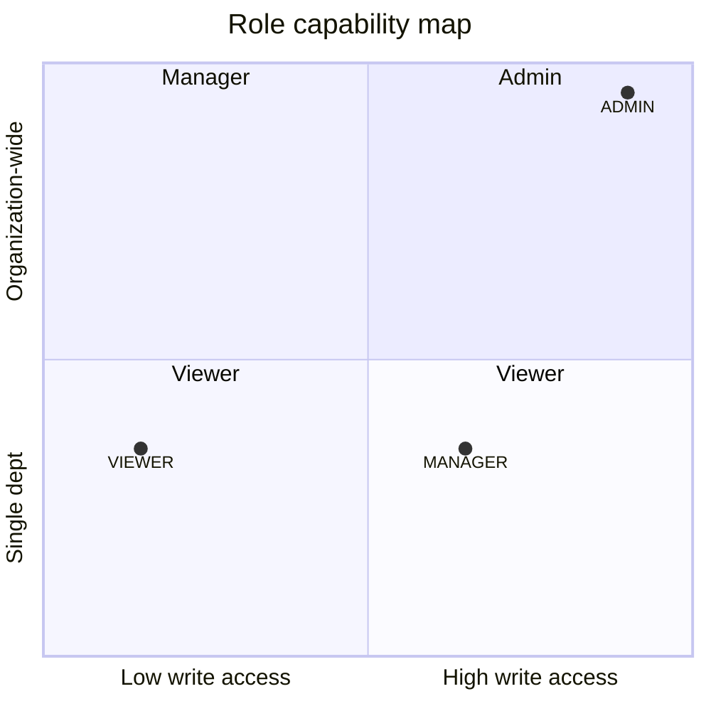

| Capability | ADMIN | MANAGER | VIEWER |
|:-----------|:-----:|:-------:|:------:|
| Org-wide data scope | ✓ | — | — |
| Department scope | ✓ | ✓ | ✓ |
| Write assets / maintenance | ✓ | ✓ | — |
| Run AI pipeline | ✓ | ✓ | — |
| Enhanced reports | ✓ | ✓ | — |
| AI assistant | ✓ | ✓ | ✓ |
| Manage departments/employees | ✓ | — | — |

---

## Skills demonstrated (recruiter checklist)

- [x] **System design** — layered backend, feature-sliced frontend, clear boundaries
- [x] **REST API design** — resource-oriented routes, Pydantic validation, OpenAPI
- [x] **Database modeling** — migrations, repositories, relational integrity
- [x] **Authentication & authorization** — JWT + granular RBAC + row-level scoping
- [x] **Machine learning integration** — train → infer → explain → cache
- [x] **LLM integration** — optional Ollama with template fallbacks
- [x] **Modern React** — hooks, TanStack ecosystem, composition patterns
- [x] **Data visualization** — Recharts dashboards + executive reports
- [x] **UX for enterprise** — attention queues, scope labels, 3D affordances
- [x] **Testing** — pytest for critical paths
- [x] **DevOps awareness** — health/ready endpoints, env-based config, seed scripts

---

## Quick start

### Prerequisites

Python 3.11+ · Node 20+ · PostgreSQL · (optional) Ollama

### Backend

```bash
cp .env.example .env          # set DATABASE_URL, JWT_SECRET_KEY
pip install -r requirements.txt
alembic upgrade head
python -m app.seeding --profile demo --reset
uvicorn app.main:app --reload  # → http://127.0.0.1:8000
```

### Frontend

```bash
cd frontend
cp .env.example .env
npm install
npm run dev                    # → http://localhost:5173
```

### Ollama (optional)

```bash
ollama pull llama3.2:3b
# .env: ASSISTANT_USE_OLLAMA=true
```

---

## Demo walkthrough

```mermaid
journey
  title 5-Minute Mentor Demo
  section Login: 1: User
    Enterprise 3D hero: 5: User
    Sign in as ADMIN: 5: User
  section Operations: 2: User
    My Workspace + KPIs: 5: User
    Run AI pipeline: 4: User
    Click high-risk 3D preview: 5: User
  section Asset lifecycle: 2: User
    Open IT-LAP-0001: 5: User
    Assign + Transfer + Timeline: 5: User
    Intelligence tab assessment: 5: User
  section AI: 1: User
    Assistant chat: 5: User
  section Reports: 1: User
    Toggle Enhanced analysis: 5: User
```

| Demo asset | Tag | Show |
|------------|-----|------|
| Laptop | `IT-LAP-0001` | Lifecycle + intelligence |
| Server | `SRV-PROD-01` | High-risk 3D rack visual |
| Printer | `ADM-PRT-001` | Maintenance recommendations |
| Van | `OPS-VAN-001` | Fleet operations |

Full script: [`docs/DEMO.md`](docs/DEMO.md)

---

## Testing

```bash
pytest tests/ -v                              # backend
cd frontend && npx tsc --noEmit && npm run build  # frontend
```

| Test module | Covers |
|-------------|--------|
| `test_auth_integration.py` | login, JWT, password change |
| `test_permissions.py` | role permission matrix |
| `test_access_scope.py` | department scoping |
| `test_health.py` | /health, /ready |
| `test_reports_analytics_benchmarks.py` | executive report data |

---

## Environment variables

| Variable | Layer | Purpose |
|----------|-------|---------|
| `DATABASE_URL` | Backend | PostgreSQL connection |
| `JWT_SECRET_KEY` | Backend | Token signing |
| `ML_ENABLED` | Backend | Enable inference path |
| `ASSISTANT_USE_OLLAMA` | Backend | LLM on/off |
| `OLLAMA_MODEL` | Backend | e.g. `llama3.2:3b` |
| `SCHEDULER_ENABLED` | Backend | Background pipeline |
| `VITE_API_BASE_URL` | Frontend | API base URL |

---

## Design principles

1. **Operations-first** — show what to do next, not just counts  
2. **Scoped truth** — same department filter in API and UI  
3. **AI with accountability** — explanations, sources, fallbacks  
4. **Layered & testable** — thin handlers, fat services, isolated repos  
5. **Demo-resilient** — works without Ollama; degrades gracefully  

---

## Documentation index

| Doc | Purpose |
|-----|---------|
| [`docs/DEMO.md`](docs/DEMO.md) | Step-by-step demo script |
| [`docs/FRONTEND_ARCHITECTURE.md`](docs/FRONTEND_ARCHITECTURE.md) | Screen-to-API blueprint |
| [`ml/README.md`](ml/README.md) | ML training pipeline |
| [`scripts/dev/README.md`](scripts/dev/README.md) | Diagnostic scripts |

---

<div align="center">

<br/>

**AssetFlow AI**

*Built to prove full-stack ownership — from database schema to 3D dashboard UX.*

<br/>

```
FastAPI  ·  React  ·  PostgreSQL  ·  FT-Transformer  ·  Ollama  ·  RBAC
```

</div>
